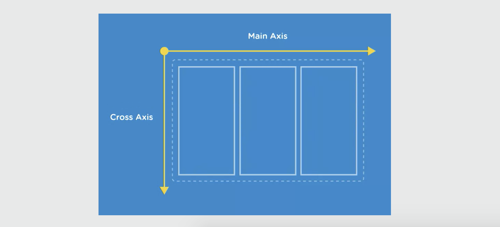
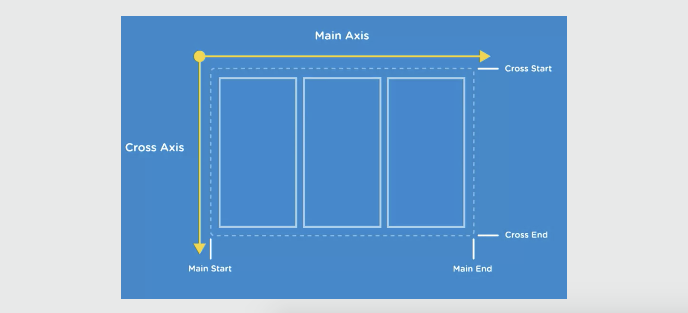
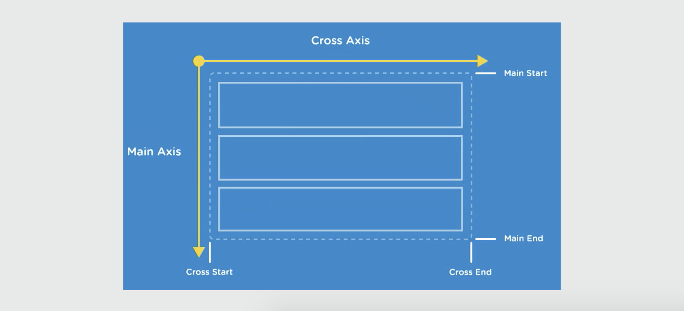

# Flexbox Layout

Important Flexbox Elements

## Flexbox Container and Items

* **Flex containers** - sets the context for the layout and contains flex items, the actual element you layout using flexbox. It can be any block level or inline element (like a ```<div>```, ```<ul>```, etc.)
* **Flex items** - every direct child of a flex container is called a flex item. There can be any number of flex items inside a flex container.

Say the ```<ul>``` is a Flex container and the ```<li>``` elements are the Flex items. Once the children are Flex items, you can take advantage of Flexbox's powerful alignment properties.

Flex Container & Flex Items

<kbd></kbd>

With Flexbox's alignment properties, the ```<li>``` can be laid out in any direction and can have flexible dimensions that adapt to the available space inside the ```<ul>```.

## Flexbox Axes

Everything in a Flexbox is **relative** to these two axes.

* **Main axis** - is the primary axis (top horizontal) along which Flex items are laid out. It defines the direction of the Flex items in the Flex container.

* **Cross axis** - runs perpendicular to the Main axis

<kbd></kbd>

Each axis has a start side and an end side.

* The default **main start** and the **main end** direction of the main axis is left to right.
* The default direction of the cross axis is top to bottom.

<kbd></kbd>

But, you can easily change the directions. For example, you can switch **column layout** along the main axis to a vertical layout using Flexbox properties.

<kbd></kbd>

## index.html

Notice that there's a ```<div class="container">``` and nested inside of the div are ```6 divs that share the class item```.

```
<!DOCTYPE html>
<html>
  <head>
    <title>Flexbox Layout</title>
    <link href='https://fonts.googleapis.com/css?family=Varela+Round' rel='stylesheet' type='text/css'>
    <link rel="stylesheet" href="css/page.css">
    <link rel="stylesheet" href="css/flexbox.css">
  </head>
  <body>
    <div class="container">
      <div class="item-1 item">Item 1</div>
      <div class="item-2 item">Item 2</div>
      <div class="item-3 item">Item 3</div>
      <div class="item-4 item">Item 4</div>
      <div class="item-5 item">Item 5</div>
      <div class="item-6 item">Item 6</div>
    </div>
  </body>
</html>
```

## page.css

Some base styles for the page. Adds ```white``` to the background of the ```containter```. The divs with ```item``` class inside has a ```light-blue``` background and ```5px margins```.

Currently, the item divs are in the normal document flow. They display as **stacked block level elements** in the order they appear on the mark-up. We'll cahnge it up in the **flex.css** file.

```
* {
	box-sizing: border-box;
}
body {
	font-size: 1.35em;
	font-family: 'Varela Round', sans-serif;
	color: #fff;
	background: #e8e9e9;
	padding-left: 5%;
	padding-right: 5%;
}
.container {
	padding: 10px;
	background: #fff;
  border-radius: 5px;
	margin: 45px auto;
  box-shadow: 0 1.5px 0 0 rgba(0,0,0,0.1);
}
.item {
	color: #fff;
	padding: 15px;
	margin: 5px;	
	background: #3db5da;
	border-radius: 3px;
}
```

## flexbox.css

Flexbox styles will be done here. When we apply Flexbox layout, you can place them anywhere in the container. For example, you can make the ```item``` appear side-by-side and make the last one appear first/second/third/fourth.

But, before we can use any Flexbox property, we need to **define a Flex container** in our layout.

In this example, our ```container``` div will be the Flex container.


```
.container {
  display: flex;
  height: 300px;
}
```