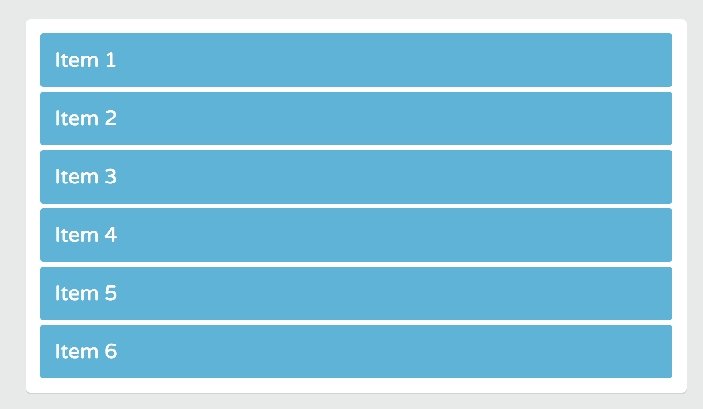
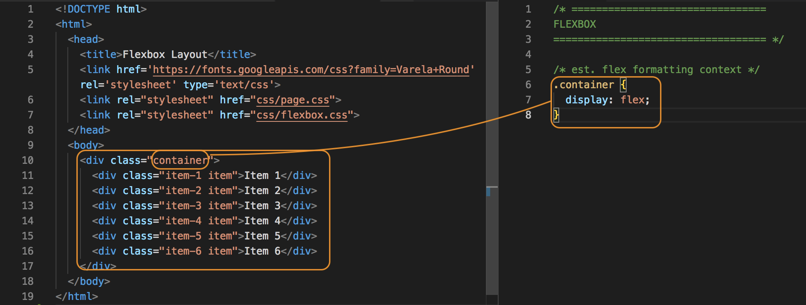
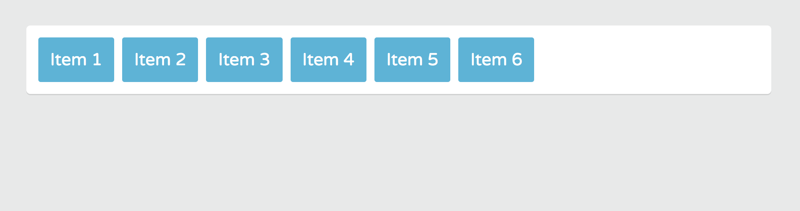

# Flexbox Layout Example

## index.html

Notice that there's a ```<div class="container">``` and nested inside of the div are ```6 divs that share the class item```.

```
<!DOCTYPE html>
<html>
  <head>
    <title>Flexbox Layout</title>
    <link href='https://fonts.googleapis.com/css?family=Varela+Round' rel='stylesheet' type='text/css'>
    <link rel="stylesheet" href="css/page.css">
    <link rel="stylesheet" href="css/flexbox.css">
  </head>
  <body>
    <div class="container">
      <div class="item-1 item">Item 1</div>
      <div class="item-2 item">Item 2</div>
      <div class="item-3 item">Item 3</div>
      <div class="item-4 item">Item 4</div>
      <div class="item-5 item">Item 5</div>
      <div class="item-6 item">Item 6</div>
    </div>
  </body>
</html>
```

## page.css

Some base styles for the page. Adds ```white``` to the background of the ```containter```. The divs with ```item``` class inside has a ```light-blue``` background and ```5px margins```.

Currently, the item divs are in the normal document flow. They display as **stacked block level elements** in the order they appear on the mark-up. We'll change it up in the **flex.css** file.

```
* {
	box-sizing: border-box;
}
body {
	font-size: 1.35em;
	font-family: 'Varela Round', sans-serif;
	color: #fff;
	background: #e8e9e9;
	padding-left: 5%;
	padding-right: 5%;
}
.container {
	padding: 10px;
	background: #fff;
  border-radius: 5px;
	margin: 45px auto;
  box-shadow: 0 1.5px 0 0 rgba(0,0,0,0.1);
}
.item {
	color: #fff;
	padding: 15px;
	margin: 5px;	
	background: #3db5da;
	border-radius: 3px;
}
```

Initial styling from just index.html and page.css styling looks like this:

<kbd></kbd>

## flexbox.css

Flexbox styles will be done here. When we apply Flexbox layout, you can place them anywhere in the container. For example, you can make the ```item``` appear side-by-side and make the last one appear first/second/third/fourth.

But, before we can use any Flexbox property, we need to **define a Flex container** in our layout.

In this example, take our parent ```container``` div will be the Flex container.

* Flexbox give you a whole new way of using the CSS **display** property. 

You create a Flex container by setting the display property of an element to one of the Flexbox layout styles.

* ```.container { display: flex}``` - establishes a flex formatting context inside the container div. So, every item div inside the container div automatically becomes a Flex item.

<kbd></kbd>

How **flex** changed the container's layout. 

```
.container {
  display: flex;
}
```

We now see the default behavior of Flexbox layout. The Flex items are laid out horizontally on the **main axis** from left-to-right. 

<kbd></kbd>

They're also laid out on the cross axis from the top start side to the bottom inside of the flex container. This means that the Flex item expands to fill the full height of the Flex container.

Let's see what happens when we increase the height of the container. Give the ```.container``` rule of ```height``` property and set the value to 300px;

```
.container {
  display: flex;
  height: 300px;
}
```