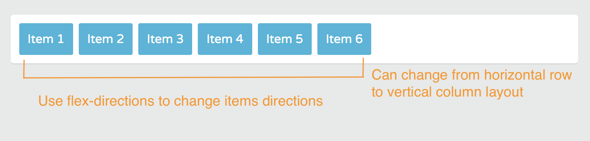
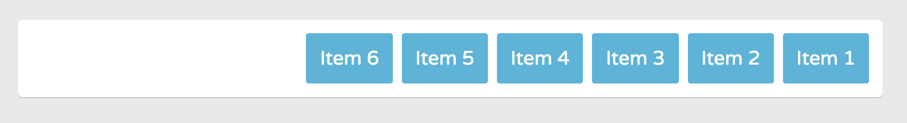
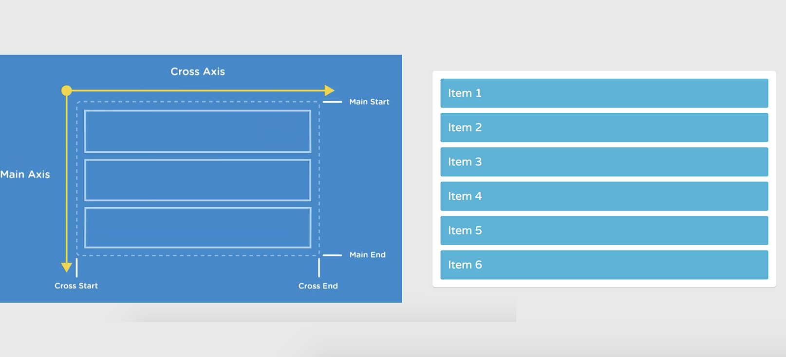
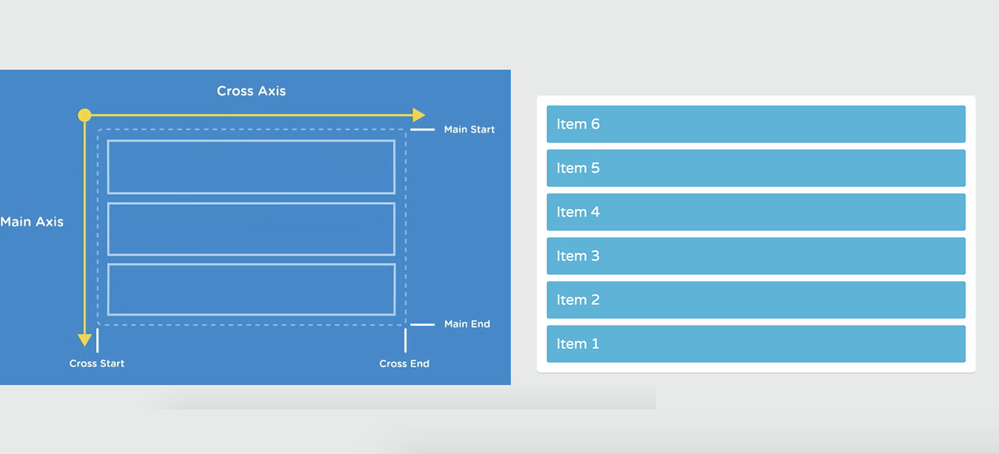

# Controlling the Direction of Flex Items

After creating a Flexbox container with ```display: flex``` or ```display: inline-flex```, we can start taking advantage of the powerful **direction-order**, **alignment** and **sizing** properties.

Some Flexbox properties apply to the Flex containers only. While some apply only to the Flex items. So, it's important to know which properties apply to the Flex containers and which to the Flex items.

* [flex-direction- - MDN](https://developer.mozilla.org/en-US/docs/Web/CSS/flex-direction)
* [A Complete Guide to Flexbox](https://css-tricks.com/snippets/css/a-guide-to-flexbox/)

## Flex-direction property - Flex container

You can to control the direction of your flexbox layout, with the ```flex-direction``` property.

* It applies to a Flex container only
* You can change the direction of Flex items from a horizontal row layout to a vertical column layout.
* You can also reverse the order in which the Flex items are displayed.

<kbd></kbd>

Add the ```flex-direction``` property inside the ```.container``` rule. The default value for flex-direction is ```row```. That's what we currently see in above image.

**flex.css**
```
.container {
  display: flex;
  flex-direction: row;
}
```

## flex-direction: row-reverse

To ```reverse``` the direction of Flex items that are in a row, you use the value ```row-reverse```.

```
.container {
  display: flex;
  flex-direction: row-reverse;
}
```

<kbd></kbd>

This reverses the main axis direction. It's the same horizontal layout as row, except the start and end positions of the main axis are swapped. So now, the Flex items are laid out from right to left.

## flex-direction: column

With the ```flex-direction``` property, you have full control over the Flex container's main axis. So, that means you can also switch the layout of Flex items from a horizontal row layout to a vertical column layout.

```
.container {
  display: flex;
  flex-direction: column;
}
```

So, the value ```column``` rotates the main axis, making the Flex items lay out vertically. Now, the start and end positions of the main axis run from top to bottom.

<kbd></kbd>

It also stretches from edge to edge of the Flex container.

## flex-direction: column-reverse

Like the ```row-reverse``` property, you can swap the top to bottom directions of the column with the value ```column-reverse```.

```
.container {
  display: flex;
  flex-direction: column-reverse;
}
```

<kbd></kbd>

Start thinking how you want to use ```flex-direction``` in your layout. For example, if working with **responsive navigation**, where you want the layout to be one column in small screens and a row in wider screens. Simply change the flex-directions inside the ```@media queries```.