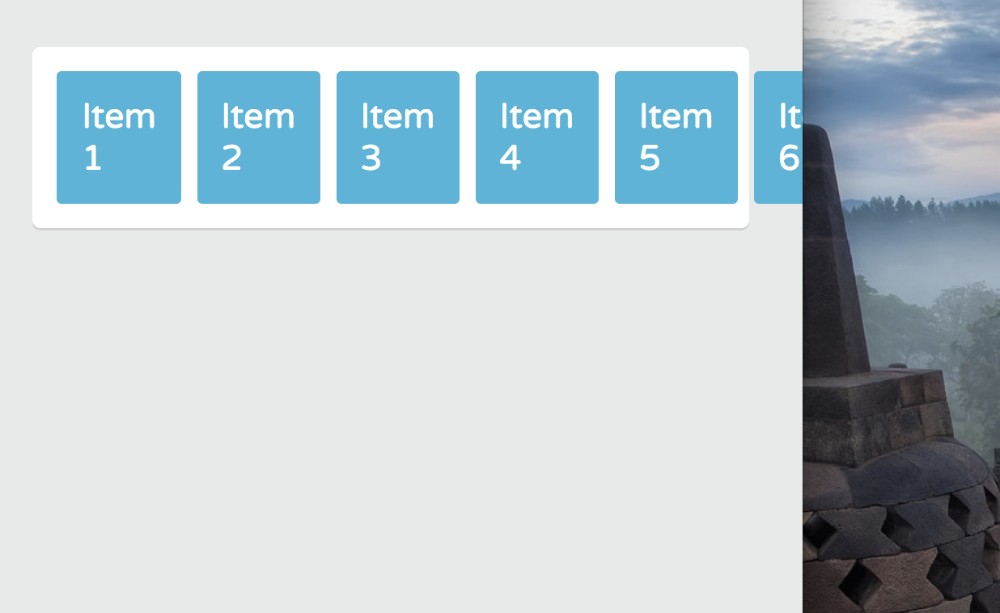
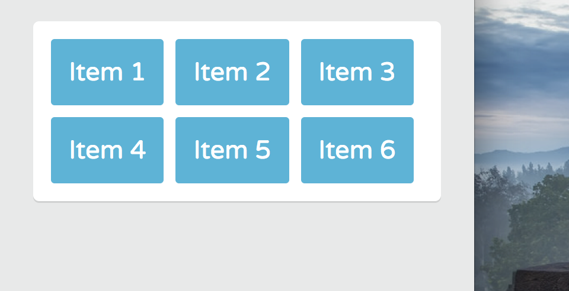
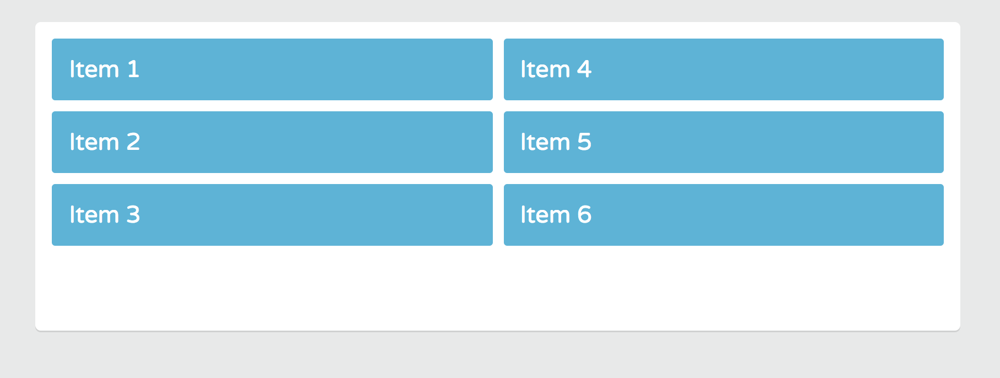
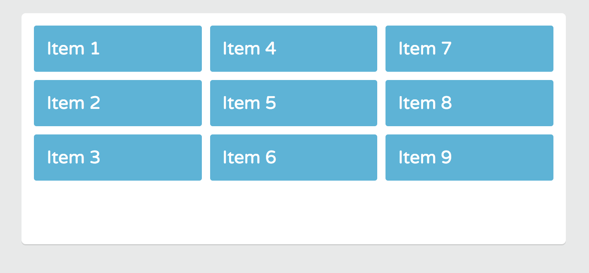
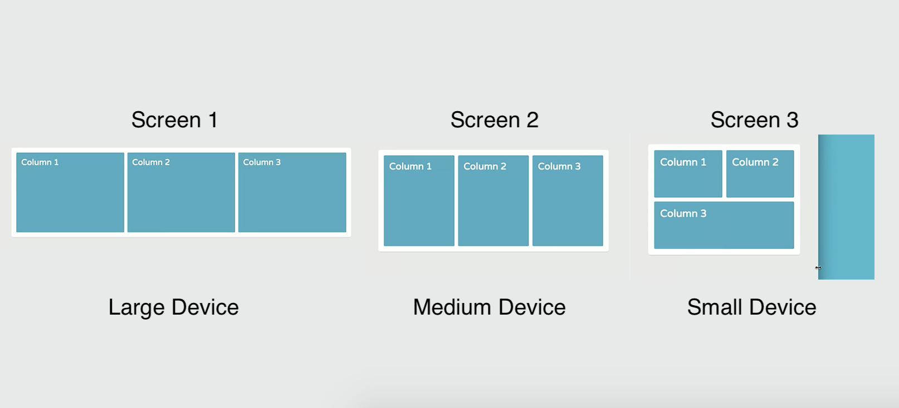

# Wrapping Flex Items

By default, the Flex container lays out flex items on a single line called a **Flex line**. A Flex container tries to fit all items on one Flex line even if it causes its contents to overflow the boundaries of the Flex container.

<kbd></kbd>

But, the Flex container can break items into multiple **flex lines** and allow them to wrap as needed.

## Flex Wrap Property

* The flex container can break flex items onto multiple lines and allow them to wrap as needed. 
* With the **flex-wrap property**, you can control whether the flex container is a single-line or multi-line layout.

```
.container {
  display: flex;
  flex-wrap: wrap;
}
```

Now, when there isn't enough room on one line, the Flex items wrap to the next line. They wrap in the direction of the main axis. Now, we have a multi-lined Flex container.

<kbd></kbd>

The same wrapping behavior applies when the ```flex-direction``` is set to ```column``` and also put a limit on the vertical space by giving ```height: 280px```.

**flex.css**
```
.container {
  display: flex;
  flex-wrap: wrap;
  flex-direction: column;
  height: 280px;
}
```

<kbd></kbd>

It'll wrap to multiple columns.

Even if you add more items to the Flex container, the browser fills the space inside the Flex container in the most efficient way possible by wrappign the items as needed.

**index.html**
```
<!DOCTYPE html>
<html>
  <head>
    <title>Flexbox Layout</title>
    <link href='https://fonts.googleapis.com/css?family=Varela+Round' rel='stylesheet' type='text/css'>
    <link rel="stylesheet" href="css/page.css">
    <link rel="stylesheet" href="css/flexbox.css">
  </head>
  <body>
    <div class="container">
      <div class="item-1 item">Item 1</div>
      <div class="item-2 item">Item 2</div>
      <div class="item-3 item">Item 3</div>
      <div class="item-4 item">Item 4</div>
      <div class="item-5 item">Item 5</div>
      <div class="item-6 item">Item 6</div>
      <div class="item-7 item">Item 7</div>
      <div class="item-8 item">Item 8</div>
      <div class="item-9 item">Item 9</div>
    </div>
  </body>
</html>
```

**flex.css**
```
.container {
  display: flex;
  flex-wrap: wrap;
  flex-direction: column;
  height: 280px;
}
```

<kbd></kbd>

Applying the ```flex-wrap``` property to a Flex item will not work.

<kbd></kbd>

Think about how you can use ```flex-wrap``` in a responsive layout. For example, a ```row``` of ```columns``` that are Flex items. Once the viewport or device starts to get narrow and the column runs out of space on a Flex line, they can automatically wrap to the next line.