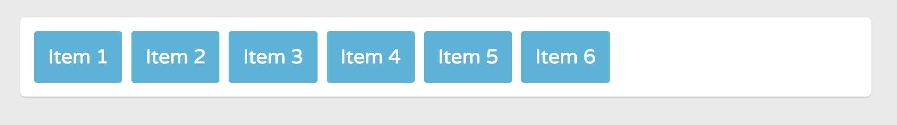
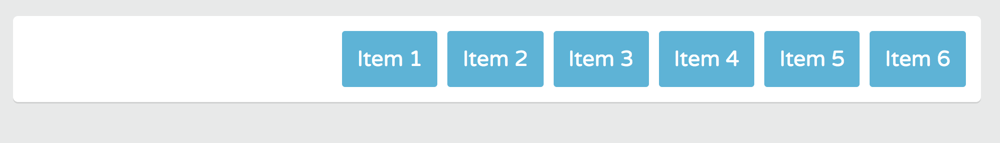
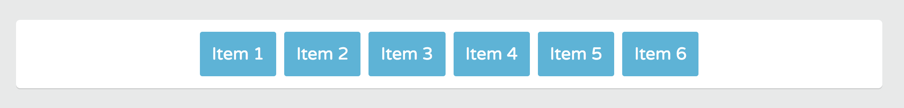

# Distributing Space Inside a Flex Container

If you've used ```floats``` or ```inline block display``` layout you know that when element run out of space, they break to the next line. Which can make parts of your layout appear broken.

Flexbox if flexible, so it can distribute available space intelligently.

When you set an element's ```display``` value to ```flex``` or ```inline-flex```, not only are you able to set a direction to how Flex items are wrapped, you're also giving the Flex container the ability to change Flex items ```width``` and ```height``` to fill the space inside the Flex container in the most efficient way possible.

## justify-content property

The ```justify-content``` property lets you control the position and alignment of Flex items on the main axis and how space should be distributed in a flex container.

In **page.css**, we can see that ```.container``` has ```10px``` of ```padding``` applied and the ```.item``` have ```5px``` of ```margin``` applied.

```
.container {
	padding: 10px;
	background: #fff;
  border-radius: 5px;
	margin: 45px auto;
  box-shadow: 0 1.5px 0 0 rgba(0,0,0,0.1);
}
.item {
	color: #fff;
	padding: 15px;
	margin: 5px;	
	background: #3db5da;
	border-radius: 3px;
}
```
So, the ```justify-content``` property will distribute the space that's available after the ```padding``` and ```margins``` are accounted from **page.css**.

You apply the ```justify-content``` property to Flex containers only.

Back in **flexbox.css**, give the ```.container``` rule the class ```justify-content```. The default value for it is ```flex-start```.

## justify-content: flex-start

It places the items towards the start of each Flex line.

<kbd></kbd>

## justify-content: flex-end

It places the items at the end of each Flex line.

<kbd></kbd>

## justify-content: flex-center

It places the items towards the center of each Flex line and with equal amounts of empty space between the line's start edge of first item and the last item.

<kbd></kbd>

The most useful **justified content** are ```space-between``` and ```space-around```. These values evenly distribute the available space in a line.