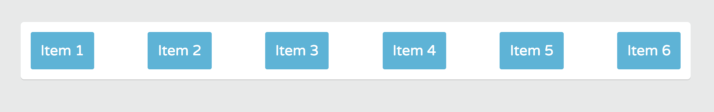
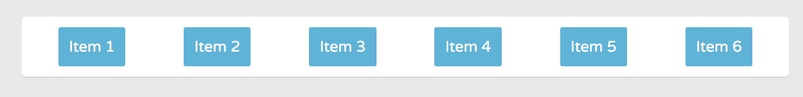
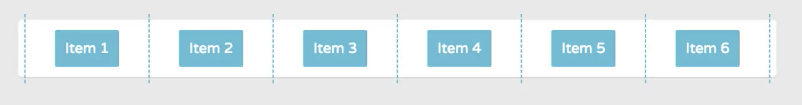
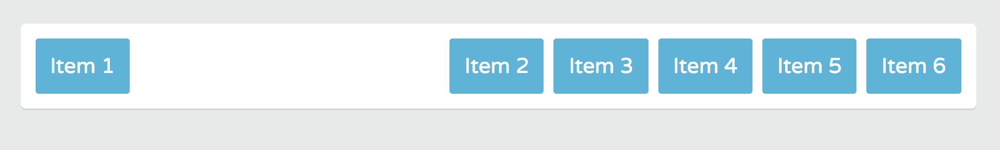
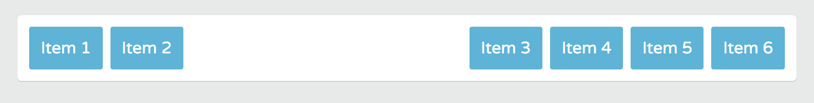

# Distributing Space Inside a Flex Container

If you've used ```floats``` or ```inline block display``` layout you know that when element run out of space, they break to the next line. Which can make parts of your layout appear broken.

Flexbox if flexible, so it can distribute available space intelligently.

When you set an element's ```display``` value to ```flex``` or ```inline-flex```, not only are you able to set a direction to how Flex items are wrapped, you're also giving the Flex container the ability to change Flex items ```width``` and ```height``` to fill the space inside the Flex container in the most efficient way possible.

## justify-content property

The ```justify-content``` property lets you control the position and alignment of Flex items on the main axis and how space should be distributed in a flex container.

In **page.css**, we can see that ```.container``` has ```10px``` of ```padding``` applied and the ```.item``` have ```5px``` of ```margin``` applied.

```
.container {
	padding: 10px;
	background: #fff;
  border-radius: 5px;
	margin: 45px auto;
  box-shadow: 0 1.5px 0 0 rgba(0,0,0,0.1);
}
.item {
	color: #fff;
	padding: 15px;
	margin: 5px;	
	background: #3db5da;
	border-radius: 3px;
}
```
So, the ```justify-content``` property will distribute the space that's available after the ```padding``` and ```margins``` are accounted from **page.css**.

You apply the ```justify-content``` property to Flex containers only.

Back in **flexbox.css**, give the ```.container``` rule the class ```justify-content```. The default value for it is ```flex-start```.

## justify-content: flex-start

It places the items towards the start of each Flex line.

<kbd></kbd>

## justify-content: flex-end

It places the items at the end of each Flex line.

<kbd></kbd>

## justify-content: flex-center

It places the items towards the center of each Flex line and with equal amounts of empty space between the line's start edge of first item and the last item.

<kbd></kbd>

## Most Useful ```justified-content```

* **space-between** - displays Flex items with equal spacing between them.
* **space-around** - displays equal spacing aroudn every Flex item. It's useful if you've set a background or border around a container and you want more space along the edges.

The most useful **justified content** are ```space-between``` and ```space-around```. These values evenly distribute the available space in a line. So, you don't have to do any math bc the browser will automatically figure out the proper amount of space.

So, in if we want the ```justify-content: center``` to be spaced out evenly, on the line, instead of spending time figuring out ```fluid margin``` or ```padding values``` for this, like you would using other CSS layout methods like ```floats``` and ```inline block```. We can have Flaxbox figure out the spacing for us.

Back in **flex.css** ```.container``` rule, set the ```justify-content``` value to ```space-between```.

```
.container {
  display: flex;
  flex-wrap: wrap;
  justify-content: space-between;
}
```

<kbd></kbd>

The first and last items are aligned to the edges of the Flex container. Then, Flexbox equally distributes the space between the remaining Flex items.

```
.container {
  display: flex;
  flex-wrap: wrap;
  justify-content: space-around;
}
```

<kbd></kbd>

The spacing between the Flex items are evenly distributed bc is distributes the space between the first and last Flex item and the container edges. 

<kbd></kbd>

And that space is equal to half the spacing between the other Flex items. Sometimes, you might not want the outer items to touch the visual edges of the Flex container.

**Margins** have a significant effect on Flex items, particularly the value ```auto```.

```
.container {
	margin: auto;
}
```

A **margin set to auto** will absorb any extra space around a Flex item and push other Flex items into different positions.

```
.container {
  display: flex;
  flex-wrap: wrap;
  justify-content: space-around;
}

.item-1 {
  margin-right: auto;
}
```

<kbd></kbd>

Notice how the first item is **flush** with the left edge of the ```.container```, while the other Flex items are placed on the **right** side.

Since ```item1``` **margin-right** is set to ```auto```, the browser automatically inserts any extra space between the first Flex item and the remaining items.

It makes it easy to **left justify** one Flex item, while **right justify** other Flex items.

You can adjust mulitple Flex items.

```
.container {
  display: flex;
  flex-wrap: wrap;
  justify-content: space-around;
}

.item-2 {
  margin-right: auto;
}
```

<kbd></kbd>

## Using ```justify-content``` in Nav

So, the **justify-content** property comes in handy when **styling a navigation** that you want to take up an entire line.

With the links evenly distributed, you can have the site logo flush with the left margin of the container, and the navigation menu perfectly placed on the right side.