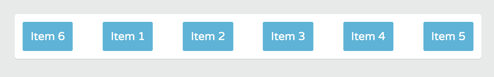
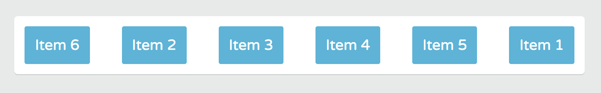
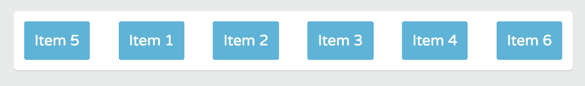
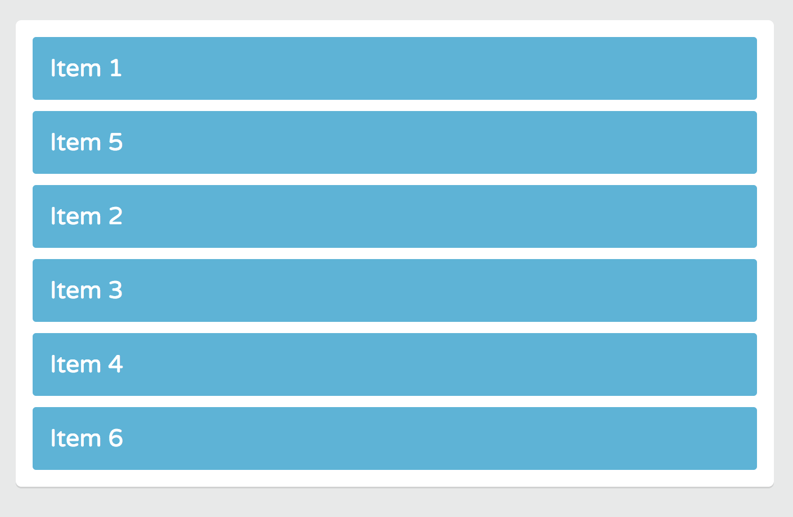

# Changing the Order of Flex Items

By default, flex items are laid out in the order they appear in the source code. We can use the `order` property to change the order of any flex item.

For example, we can make `item-6` appear first on the main axis. Even second/third/fourth/fifth. Or we can make `item-1` appear last on the main axis.

This is another feature that demonstrates the power Flexbox's **source order** dependence.

We can structure the HTML document for SEO or accessibility first. Then, rearrange the content without ever editing the HTML.

The **order property** applies to Flex items only.

## Order Property

The default order of all Flex items is zero. So, if we want to place `item-6` at the beginning of the row, you can give it any value lower than `0`.

```
.container {
  display: flex;
  flex-wrap: wrap;
  justify-content: space-between;
}

.item-6 {
  order: -1;
}
```

<kbd></kbd>

`item-6` is now first in the Flexbox order.

If we want to make `item-1` appear last, give the **order property** a higher value above `0`, like maybe `1`.

```
.container {
  display: flex;
  flex-wrap: wrap;
  justify-content: space-between;
}

.item-6 {
  order: -1;
}

.item-1 {
  order: 1;
}
```

<kbd></kbd>

How to make `item-5` **appear second** in the row.

```
.container {
  display: flex;
  flex-wrap: wrap;
  justify-content: space-between;
}

.item-5 {
  order: -1;
}

.item-1 {
  order: -2;
}
```

<kbd></kbd>

The order remains the same even if you switch to column layout.

```
.container {
  display: flex;
  flex-wrap: wrap;
  justify-content: space-between;
  flex-direction: column;
}

.item-5 {
  order: -1;
}

.item-1 {
  order: -2;
}
```

<kbd></kbd>

## Why Order Property is Useful

Bc it's useful for reordering content columns on mobile and desktop screens. For example, on mobile screen, you can place a featured content column above all columns, then make the column appear second of third in the row on large desktop screens.