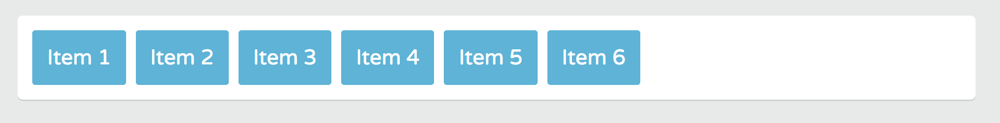
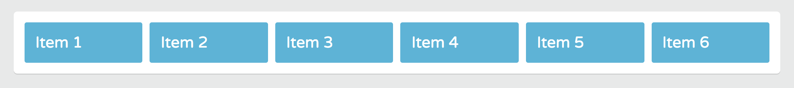
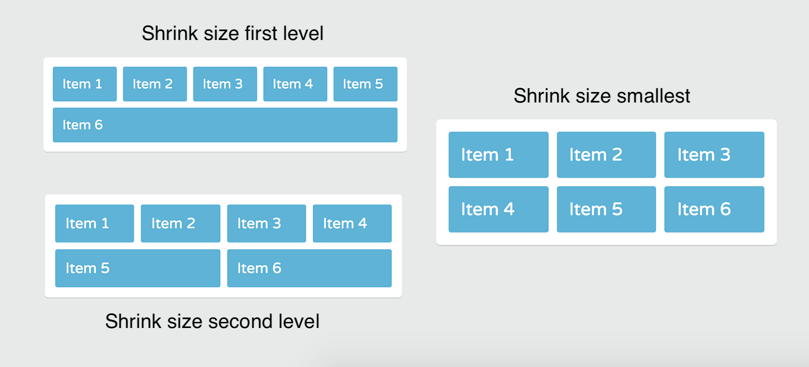
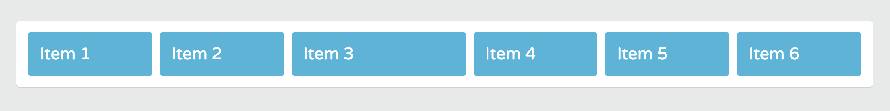
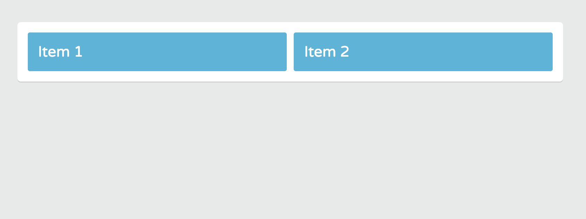
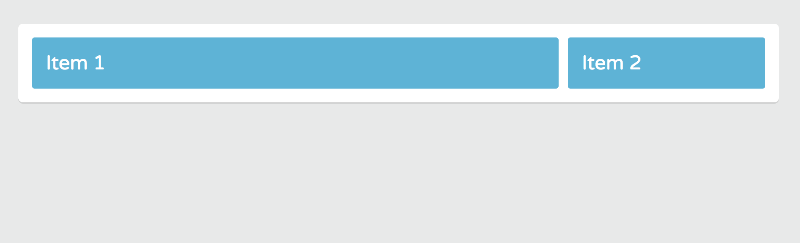

# Growing Flex Items

With flexbox you can make flex items grow or shrink in relation to other flex items and the available space inside the flex container.

For example, you can expand the items so that they fill up the entire Flex container.

<kbd></kbd>

Then, you can expand the first, the second, or any Flex item to take up more space in the `.container`.

<kbd></kbd>

## Flex Grow Property

Determines how much of tha available space inside the Flex container an item should take up. So, it assigns more or less space to Flex items.

By default, Flex items and Flex container do not take up the full space of a line.

<kbd></kbd>

But, you can expand the Flex items, so that they fill up the entire line using the **flex grow property**. 

The default value for `flex-grow` property is `0`. This means the Flex items do not expand. What happens if we set the value to `1`?

```
.container {
  display: flex;
  flex-wrap: wrap; /* gives multi-line flex container */
}

.item {
  flex-grow: 1;
}
```

<kbd></kbd>

It'll make all the items the same size in the container. The Flex item expands to take up the full space of a line.

Even as the Flex container get narrower, the Flex tiem adjust to the `width`.

<kbd></kbd>

When the Flex container can no londer distribute an equal amount of space on one line, it breaks items on to a second line where it also gives the items equal space.

Notice how `item-6` exands to take up the full space of the second line, so on.

## Why?

This is a handy feature for building responsvie layouts. For instance, you can display a certain number of equal width column on one row (wide desktop screens), then on smaller screen, where the row will be much narrower, some of the columns will appear on a second or third line.

The higher the `flex-grow` value, the more an item grows relative to the other items.

```
.container {
  display: flex;
  flex-wrap: wrap; /* gives multi-line flex container */
}

.item {
  flex-grow: 1;
}

.item-3 {
  flex-grow: 2;
}
```

For every bit of space the other Flex tiem get on one line, `item-3` will always get twice as much of that space.

<kbd></kbd>

This is great for building flexible columns. 

## If Creating a Two Column Layout

**index.html**
```
<!DOCTYPE html>
<html>
  <head>
    <title>Flexbox Layout</title>
    <link href='https://fonts.googleapis.com/css?family=Varela+Round' rel='stylesheet' type='text/css'>
    <link rel="stylesheet" href="css/page.css">
    <link rel="stylesheet" href="css/flexbox.css">
  </head>
  <body>
    <div class="container">
      <div class="item-1 item">Item 1</div>
      <div class="item-2 item">Item 2</div>
    </div>
  </body>
</html>
```

<kbd></kbd>

`item-1` as column 1 can be the main content column and `item-2` can be a sidebar column.

```
.container {
  display: flex;
  flex-wrap: wrap; /* gives multi-line flex container */
}

.item {
  flex-grow: 1;
}

.item-1 {
  flex-grow: 4;
}
```

This time, the main content column, will take up 4x as much space as the sidebar.

<kbd></kbd>