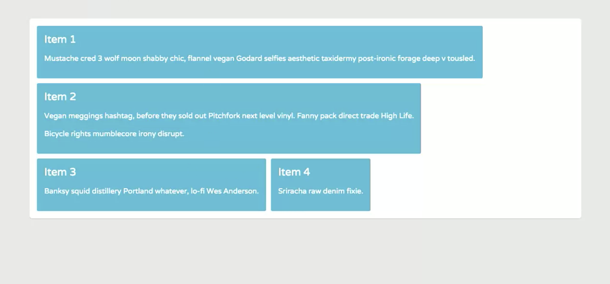
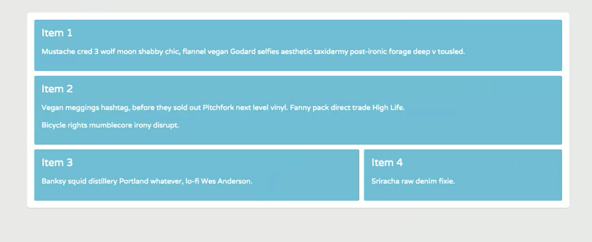
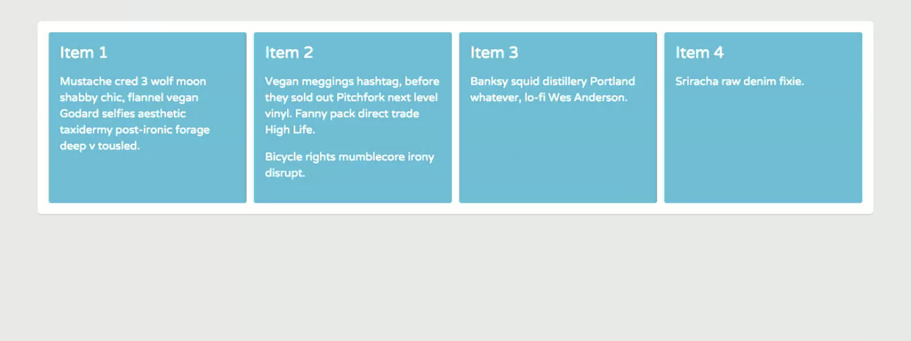
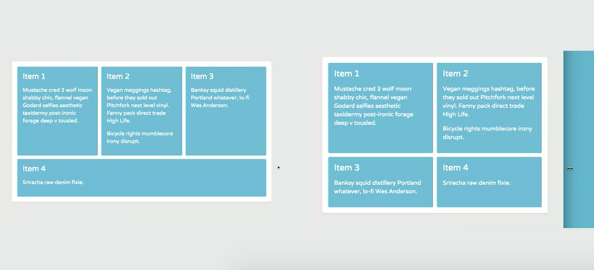
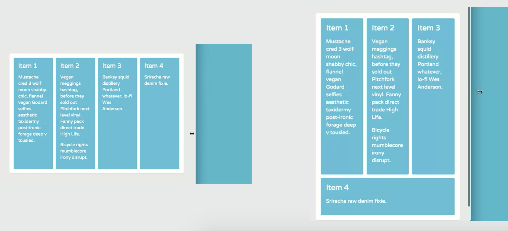
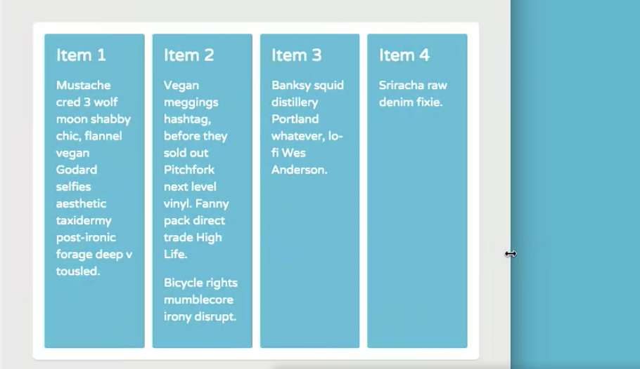
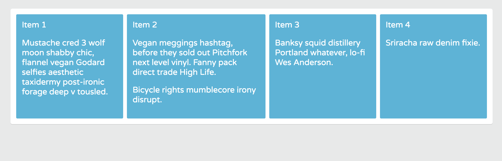

# Smarter Layouts with `flex-basis` and `flex`

Learn how the flex-basis property gives you even more control over the size of flex items, and how the flex shorthand property intelligently sets flexbox values when you don't specify them.

* `flex` and `flex-basis` apply to flex items only.
* `flex-basis` specifies the initial main size of a flex item.
* You set the initial size you want the flex items to be, then flexbox evenly distributes the free space according that size.
* Using only one number value for flex sets the flex-grow value of an item.
* The second and third values are optional in the flex shorthand.
* Setting only one number value for flex automatically sets the flex-basis value to 0.

In the new code in **index.html** some items have more content than others.

**index.html**
```<!DOCTYPE html>
<html>
  <head>
    <title>Flexbox Layout</title>
    <link href='https://fonts.googleapis.com/css?family=Varela+Round' rel='stylesheet' type='text/css'>
    <link rel="stylesheet" href="css/page.css">
    <link rel="stylesheet" href="css/flexbox.css">
  </head>
  <body>
    <div class="container">
      <div class="item-1 item">
        Item 1
        <p>Mustache cred 3 wolf moon shabby chic, flannel vegan Godard selfies aesthetic taxidermy post-ironic forage deep v tousled.</p>
      </div>
      <div class="item-2 item">
        Item 2
        <p>Vegan meggings hashtag, before they sold out Pitchfork next level vinyl. Fanny pack direct trade High Life.</p>
        <p>Bicycle rights mumblecore irony disrupt.</p>
      </div>
      <div class="item-3 item">
        Item 3
        <p>Banksy squid distillery Portland whatever, lo-fi Wes Anderson.</p>
      </div>
      <div class="item-4 item">
        Item 4
        <p>Sriracha raw denim fixie.</p>
      </div>
    </div>
  </body>
</html>
```

<kbd></kbd>

In **flexbox.css**, when we target `item` and set their `flex-grow` value to `1`:

```
.container {
  display: flex;
  flex-wrap: wrap;
}

.item {
  flex-grow: 1;
}
```

<kbd></kbd>

The browser tries its best to equally distribute the space inside the container. Some Flex items are wider than others bc the amount of content inside them.

## What if Your Layout Requires Equal Width items? - Use `flex-basis`

It'll give you even more control over the size of your Flex items. So have to set the initial size of the Flex items, then the Flexbox evenly distributes the free space according to that size.

`flex-basis` accepts the same values as the `width` and `height` properties, so pixels, percentages and other units.

This example, the Flex items will display at an equal size when they're 200 pixels or wider.

```
.container {
  display: flex;
  flex-wrap: wrap;
}

.item {
  flex-grow: 1;
  flex-basis: 200px;
}
```

But if and when they're narrower than 200px, the browser will redistribute the space. The Flex items have **flexible widths**. When the browser gets narrow, the items break into multiple lines.

<kbd></kbd>

Narrower browser:

<kbd></kbd>

If the `flex-basis` value is changed to `100px`, items are now equllay sized until narrower than the `flex-basis` value of `100px`.

```
.container {
  display: flex;
  flex-wrap: wrap;
}

.item {
  flex-grow: 1;
  flex-basis: 100px;
}
```

<kbd></kbd>

## `flex` Shorthand Property (recommended)

When setting both the `flex-grow` and `flex-basis` value of a Flex item, it's recommended that you use the `flex` shorthand property instead of the individual properties.

* `flex` is the shorthand for `flex-grow`, `flex-basis` and `flex-shrink`.
* `flex-shrink` property - does the opposite of `flex-grow`

The `flex` shorthand property intelligently sets some of the values for, when you don't specify them.

The second and thrid values, for `flex-shrink` and `flex-basis` in the `flex` shorthand are optional.

```
.item {
  flex: flex-grow flex-basis flex-shrink;
}
```

Using only `1` number value sets the `flex-grow` value of the items.

```
.item {
  flex: 1;
}
```

And it automatically set the `flex-basis` value to `0`, which makes the items proportional within the space the Flex container, but the Flex items do not redistribute the space inside the Flex container when it's narrowed.

<kbd></kbd>

So, they don't break to new lines bc `flex-basis: 0` means that the items can shrink all the way to the `width: 0px`.

## What if We Want the Initial Size to be 200px

```
.container {
  display: flex;
  flex-wrap: wrap;
}

.item {
  flex: 1 200px;
}
```

Now, it's back to normal and is redistributing like before.

## Grow Size of Only 1 Item with `flex-grow` property

```
.container {
  display: flex;
  flex-wrap: wrap;
}

.item {
  flex: 1 200px;
}

.item-2 {
  flex-grow: 2;
}
```

`item-2` will get twice as much space.

<kbd></kbd>

We're not using the `flex` shorthand here bc we only want to affect `item-2`'s `flex-grow`. Using the shorthand will reset `item-2`'s `flex-basis` back to `0`, making it not grow at all.

[flex - MDN](https://developer.mozilla.org/en-US/docs/Web/CSS/flex)\
[flex-grow - MDN](https://developer.mozilla.org/en-US/docs/Web/CSS/flex-grow)\
[flex-basis - MDN](https://developer.mozilla.org/en-US/docs/Web/CSS/flex-basis)\
[flex-shrink](https://developer.mozilla.org/en-US/docs/Web/CSS/flex-shrink)