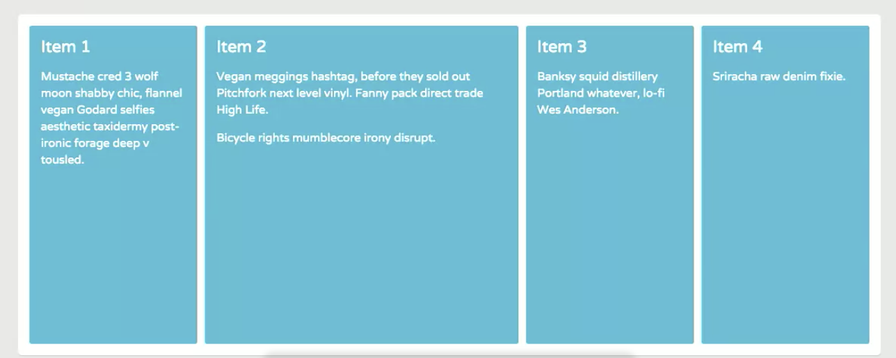
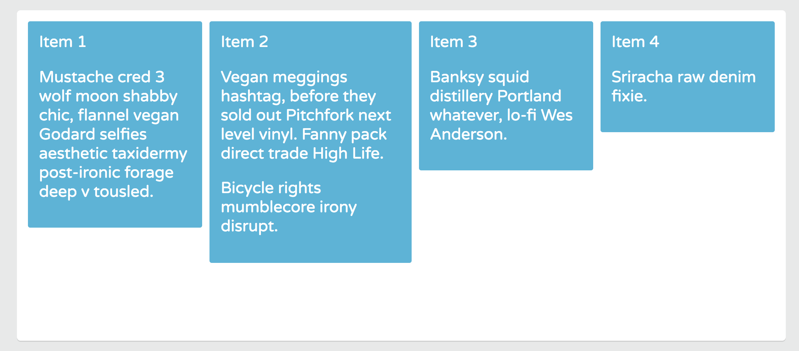
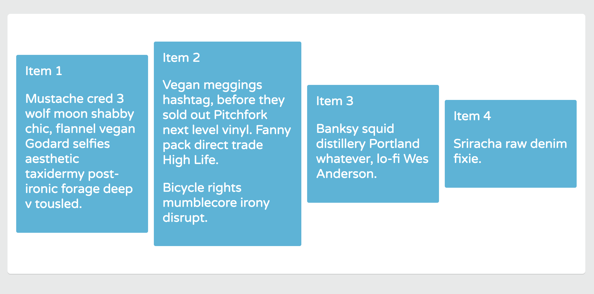
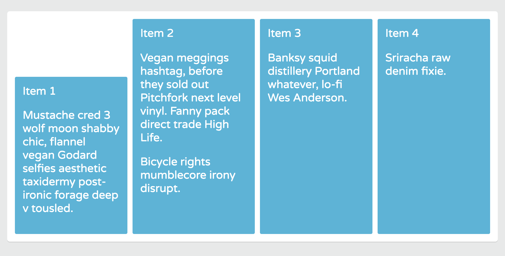
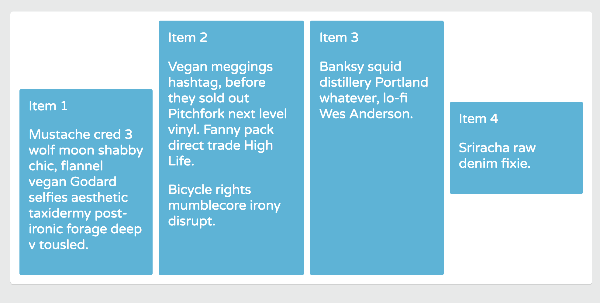

# Aligning Flex Items on the Cross Axis

Align flex items on the cross axis with the `align-items` and `align-self` properties. In this example, the cross axis runs from top to bottom.

## `align-items` Property

To align the items vertically to the container. Give the Flex container a height to create more vertical space of `450px`. Add the `align-items` property. It only works with the Flex container only. The default value for a line items is `stretch`.

The Flex items stretch from the start of the cross axis to the end. That's why Flex items are equal height by default. They expand/stretch to fill the Flex container.

```
.container {
  display: flex;
  flex-wrap: wrap;
  height: 450px;
  align-items: stretch;
}

.item {
  flex: 1 200px;
}

.item-2 {
  flex-grow: 2;
}
```

<kbd></kbd>

## Align all Flex items to the start of the Cross Axis

Use the value `flex-start` with the `align-item` property.

## `flex-start`

```
.container {
  display: flex;
  flex-wrap: wrap;
  height: 450px;
  align-items: flex-start;
}

.item {
  flex: 1 200px;
}

.item-2 {
  flex-grow: 2;
}
```

<kbd></kbd>

Now the `heights` no longer stretch from top to bottom. The Flex items are aligned to the start of the Cross axis.

## `flex-end`

```
.container {
  display: flex;
  flex-wrap: wrap;
  height: 450px;
  align-items: flex-end;
}

.item {
  flex: 1 200px;
}

.item-2 {
  flex-grow: 2;
}
```

<kbd></kbd>

## `center` is the most useful values for `align-items`

Makes centering an element inside its container easier than ever! The Flex items become perfectly centered in the Cross axis.

```
.container {
  display: flex;
  flex-wrap: wrap;
  height: 450px;
  align-items: center;
}

.item {
  flex: 1 200px;
}

.item-2 {
  flex-grow: 2;
}
```

<kbd></kbd>

## Alignment for individual Flex items - `align-self`

It also let's you override the alignment defined in the `align-items` property placed in `.container` rule.

Remember by default, if the `align-items` rule is removed, it's default is just `stretch`.

## `align-self: flex-start`

Now, we want to align `item-1` to the top edge of the container.

```
.container {
  display: flex;
  flex-wrap: wrap;
  height: 450px;
}

.item {
  flex: 1 200px;
}

.item-1 {
  align-self: flex-start;
}

.item-2 {
  flex-grow: 2;
}
```

Now, `item-1` is aligned to the start of the Cross axis.

## `align-self: flex-end`

<kbd></kbd>

Now, it's aligned to the end of the Cross axis.

## `align-self: center`

If you want to align another item to `center`, like `item-4`.

```
.container {
  display: flex;
  flex-wrap: wrap;
  height: 450px;
}

.item {
  flex: 1 200px;
}

.item-1 {
  align-self: flex-end;
}

.item-2 {
  flex-grow: 2;
}

.item-4 {
  align-self: center;
}
```

<kbd></kbd>

As you can see, Flexbox was designed to help us with **alignment**. 

* The `align-items` property applies to **flex containers only**.
* The `align-self` property applies to **flex items only**.
* `align-items` aligns flex items vertically in the flex container.
* To align all flex items to the start of the cross axis, use the `align-items: flex-start`.
* `align-items: flex-end` - packs the items toward the end of the cross axis.
* `align-items: center` - perfectly centers items along the cross axis.
* `align-self: flex-start` - aligns a flex item to the start of the cross axis.
* `align-self: flex-end;` - aligns a flex item to the end of the cross axis.
* `align-self: center;` - aligns a flex item to the center of the cross axis.

[align-items - MDN](https://developer.mozilla.org/en-US/docs/Web/CSS/align-items)\
[align-self - MDN](https://developer.mozilla.org/en-US/docs/Web/CSS/align-self)