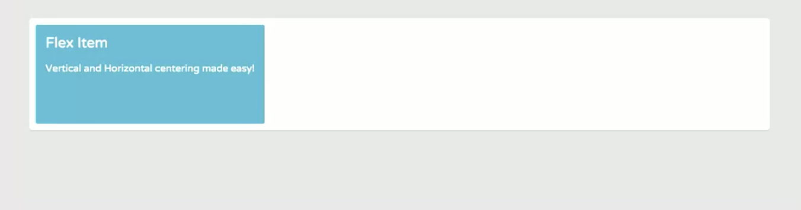
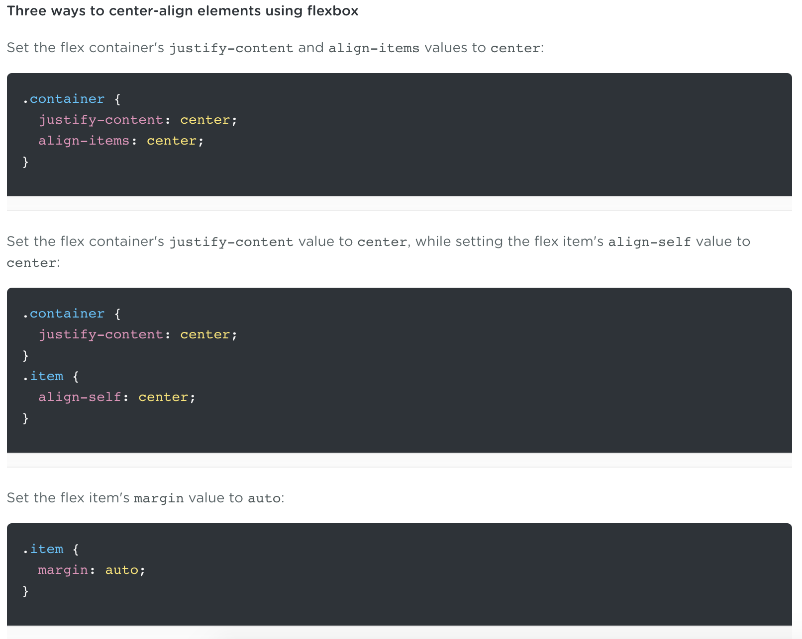

# Vertical and Horizontal Centering

Centering content is one of the trickiest and more difficult things to do in CSS layout. Even vertical centering and centering elements perfectly inside **fluid containers** are things web designers and developers usually struggle with when using properties like `float`, `display` or `position`. 

We'll learn why flexbox is the smartest solution when it comes to centering content.

* `align-items`
* `align-self`
* `justify-content`

**index.html**
```
<!DOCTYPE html>
<html>
<head>
	<title>Flexbox Layout</title>
	<link href='https://fonts.googleapis.com/css?family=Varela+Round' rel='stylesheet' type='text/css'>
	<link rel="stylesheet" href="css/page.css">
	<link rel="stylesheet" href="css/flexbox.css">
</head>
<body>
	<div class="container">
		<div class="item-4 item">
			Flex Item
			<p>Vertical and Horizontal centering made easy!</p>
		</div>
	</div>
</body>
</html>
```

The Flex container has a `fluid` `min-height: 50vh`, this means that the Flex container's height will always take up half the **view port** height.

**flexbox.css**
```
.container {
  display: flex;
  min-height: 50vh;
}
```

<kbd></kbd>

## Align Flex item to Position Perfectly Center of Container

There are 3 different ways to `center` and item using Flexbox.

```
.container {
  display: flex;
  min-height: 50vh;

  justify-content: center;
  align-items: center;
}
```

With these two declarations of `justify-content: center` and `align-items: center`, the items display perfectly centered inside the container.

<kbd></kbd>

You can also target an `item` and center it on the Cross axis using `align-self` property adn the value `center`. The result is the same, no matter the container's width or height.

```
.container {
  display: flex;
  min-height: 50vh;

  justify-content: center;
}

.item {
  align-self: center;
}
```

<kbd></kbd>

The `margin` value of `auto` has significant effect on Flex items bc the value `auto` will abosorb any extra space around a Flex item. So if we use a `margin` on the Flex item, we don't even need to include the `justify-content: center` on the `.container` or `align-self: center` on `.item`.

Only set `margin: auto` to `.item`. The browser will automatically insert space on all four sides of the Flex item.

```
.container {
  display: flex;
  min-height: 50vh;
}

.item {
  margin: auto;
}
```

<kbd></kbd>

## Summary

There no right or wrong solution. Each method does the trick. The method you use to center the content is up to you.

Now you have the tools necessary to buli websites using Flexbox.

<kbd></kbd>

## Check Browser Support

Go to [caniuse.com](http://caniuse.com) to see the latest in Browser Support.