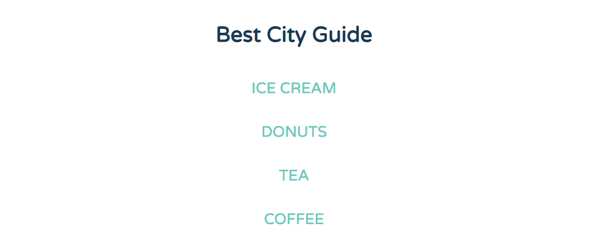
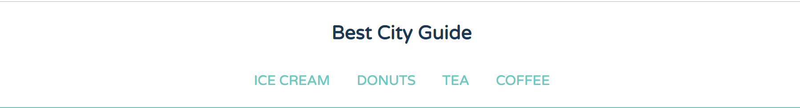

# Building a Navigation Bar with Flexbox

* Switch from vertical to horizontal on large screens for navigation bar.
* Display flexible content columns with equal heights.
* Rearranging content order based on screen size.
* Easiest solution for displaying a sticky footer.

Flexbox's source-order independence makes it the perfect tool for building a responsive website navigation.

## Viewport Sizes

**Smaller Viewport - One Column**\
You can layout the site logo and navigation in one column on narrow viewport sizes and mobile devices.

<kbd></kbd>

**Wider Viewport - Scale up to Wider Horizontal**\
In wider viewports and devices, the navigation can scale up to a wider and horizontal layout.

<kbd></kbd>

**Widest Viewport - Full Horizontal**\
The widest viewport range, you can position the navigation and site logo on the same line. So, the logo can be aligned to the left side of the page, while the navigation is aligned to the right side of the page. This can all be done with just a few lines of CSS.

<kbd></kbd>


**index.html** - Navigation
```
<header class="main-header">
  <h1 class="name"><a href="#">Best City Guide</a></h1>
  <ul class="main-nav">
    <li><a href="#">ice cream</a></li>
    <li><a href="#">donuts</a></li>
    <li><a href="#">tea</a></li>
    <li><a href="#">coffee</a></li>
  </ul>
</header><!--/.main-header-->  
```

**base.css** - Base styles, this CSS applies to all browsers from phones, tablets, to desktop computers. Bottom of stylesheet, there are 2 @media queries that center the layout containers like `main-header` and `row` and sets their `fluid width` in **wider screens** and devices.

Currently, the example starts off mobile design first and we'll adjust to larger device in the @media queries on **flexbox.css**.

## Viewport 769px or Wider

We should use Flexbox to change the vertical layout of the navigation to a horizontal layout, so that it fills the horizontal space of wider screens and devices.

Remember, the first step in creating a Flexbox layout is defining the Flex container.

**flexbox.css**
```
@media (min-width: 769px) {
	.main-header {
    display: flex;
  }
}
```

Now, the `name `and the `main-nav` elements inside the `main-header` are Flex items.

<kbd></kbd>

So now, when the viewport is `769px` or wider, the site name and navigation are on the same line. But, the `main-nav` list items are still vertically stacked. To display them side-by-side, we need to define a new Flex formatting context for the list items.

Essentially, we need to make their parent `main-nav` a Flex container, the `<ul>`.

## Grouping `main-header` and `main-nav`

* It's possible for an element to be both a flex item and a flex container too.

Make `main-nav` a Flex container by grouping it with `main-header`.

**flexbox.css**
```
@media (min-width: 769px) {

  .main-header,
  .main-nav {
    display: flex;
  }

}
```

This means that `main-nav` can accept Flex container properties and the list items `<li>` inside `main-nav` are now Flex items.

<kbd></kbd>

Now, the direction of the navigaton switches from vertical to horizontal on wider screens. So, the site name and navigation items are now laid out on the same line.

## 769px Breakpoint, Display Site Name and Nav on Separate Lines

Next, at the `769px` breakpoint, we want to display the site name and navigation on separate lines, so that the `main-header` doesn't appear too cramped on narrow screens sizes.

* We can adjust the layout using the `flex-direction` property.

Inside media query `@media (min-width: 769px)`, create a new rule that target the `main-header`. Add the `flex-direction` property and give it a value of `column`. Then, center align the navgiation by adding `align-items: center`.

**flexbox.css**
```
@media (min-width: 769px) {

  .main-header,
  .main-nav {
    display: flex;
  }

  .main-header {
    flex-direction: column;
    align-items: center;
  }

}
```

<kbd></kbd>

So now, the site name and navgiation in a column direction on separate lines, while the `main-nav` idrection remain horizontal.

## Widest Viewport on 1025px and wider

Next, when the viewport starts to get wider, we should take advantage of the extra horizontal space that opens up and position both the name and navigation on the same line.

The second media query on **flexbox.css** targets viewport widths in devices that are `1025px` and wider.

Inside this media query, select `main-header` and set its `flex-direction` to `row`.

**flexbox.css**
```
@media (min-width: 1025px) {

  .main-header {
    flex-direction: row;
  }

}
```

Now, when the viewport is `1025px` or wider, both the site name and navigation appear on the same line.

<kbd></kbd>

## Viewport on 1025px and wider Position Site Name on Left, Nav on Right

Finally, we want to position the site name on the left side of the header, the navigaiton menu on the right side. The easiest way to do this is with the `justify-content` property. The value `space-between` will align the `name` Flex item to the left edge of the container. Then `main-nav` Flex item to the right edge, and add any extra space between them.

Giving `.main-header` a `justify-content: space-between` declaration positions the site name on the left side of the header and the navigation menu on the right.

```
@media (min-width: 1025px) {

  .main-header {
    flex-direction: row;
    justify-content: space-between;
  }

}
```

<kbd></kbd>

Now, the site name is now **flush** with the left margin of the page and the navigation menu is perfectly placed on the right side.

Next, we'll layout the two columsn using Flexbox.