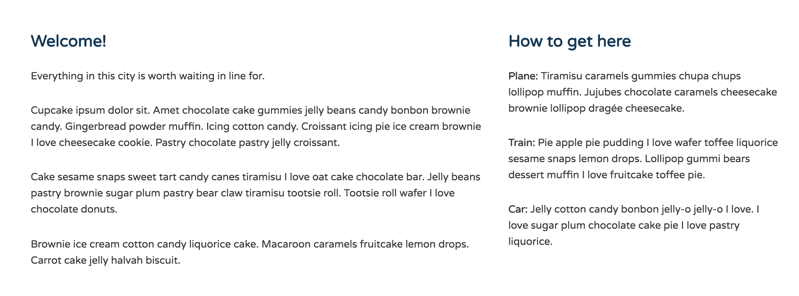
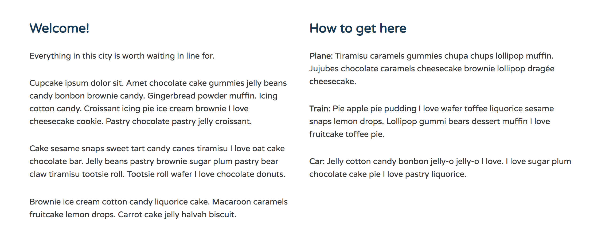
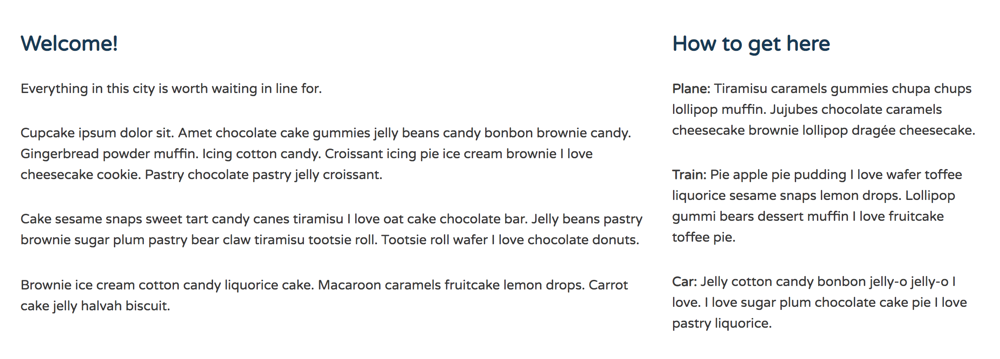

## Create Two Column Layout with Flexbox

With flexbox, it's simple to create flexible multi-column layouts without using floats or inline-block value to the display property.

In our layout so far, when the viewport or device is `769px` or wider, we want two columsn to appear side-by-side. If the viewport is `1025px` or wider, we want the primary content column on the left to take up twice as much space as the secondary content column on the right.

In **index.html**, the `<div class="primary col">` and `<div class="secondary col">` are inside a `<div class="row">`.

**index.html**
```
<div class="row">		
  <div class="primary col">
    <h2>Welcome!</h2>
    <p>Everything in this city is worth waiting in line for.</p>
    <p>Cupcake ipsum dolor sit. Amet chocolate cake gummies jelly beans candy bonbon brownie candy. Gingerbread powder muffin. Icing cotton candy. Croissant icing pie ice cream brownie I love cheesecake cookie. Pastry chocolate pastry jelly croissant.</p>
    <p>Cake sesame snaps sweet tart candy canes tiramisu I love oat cake chocolate bar. Jelly beans pastry brownie sugar plum pastry bear claw tiramisu tootsie roll. Tootsie roll wafer I love chocolate donuts.</p>
    <p>Brownie ice cream cotton candy liquorice cake. Macaroon caramels fruitcake lemon drops. Carrot cake jelly halvah biscuit. </p>
  </div><!--/.primary-->
  
  <div class="secondary col">
    <h2>How to get here</h2>
    <p><strong>Plane: </strong>Tiramisu caramels gummies chupa chups lollipop muffin. Jujubes chocolate caramels cheesecake brownie lollipop drag&#233;e cheesecake.</p>
    <p><strong>Train: </strong>Pie apple pie pudding I love wafer toffee liquorice sesame snaps lemon drops. Lollipop gummi bears dessert muffin I love fruitcake toffee pie.</p>
    <p><strong>Car: </strong>Jelly cotton candy bonbon jelly-o jelly-o I love. I love sugar plum chocolate cake pie I love pastry liquorice.</p>
  </div><!--/.secondary-->
</div>
```

So first, make `<div class="row">` the Flex container for the two columns.

In **flexbox.css** inside the `769px` media query, group the class `.row` with the `.main-header` and the `.main-nav` selectors to `display: flex`.

**flexbox.css**
```
@media (min-width: 769px) {

  .main-header,
  .main-nav,
  .row {
    display: flex;
  }

  .main-header {
    flex-direction: column;
    align-items: center;
  }

}
```
Currently in the browser, both primary and secondary columan are now Flex items. They will display on the same line once the viewport breaks at `769px` or wider.

<kbd></kbd>

The primary content is wider than the secondary column bc it contains more content and the secondary column looks a little too narrow, depending on the viewport width.

## Equal Width Columns at '769px' Viewport Breakpoint

So, at larger viewport breakpoint, we want equal width columns. We can assign an equal amount of space to Flex items with the `flex-grow` and `flex` properties.

In `@media (min-width: 769px)`, create a new rule that targets the class `.col` the add a `flex` property and set the value to `1`. Now, each column takes up an equal amount of space inside the `row`. They each take up half the space.

<kbd></kbd>

## Widest Breakpoint Make Primary Content 2x the Space of Secondary

Inside `@media (min-width: 1025px)`, select the class `primary` and give it a `flex` value of `2`.

```
@media (min-width: 1025px) {

  .main-header {
    flex-direction: row;
    justify-content: space-between;
  }

  .primary {
    flex: 2;
  }

}
```
<kbd></kbd>

Now, for every bit of space the secondary column gets, the primary column will always get twice as much of that space.