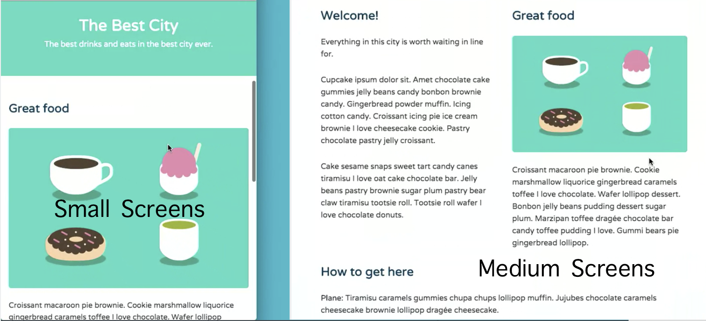
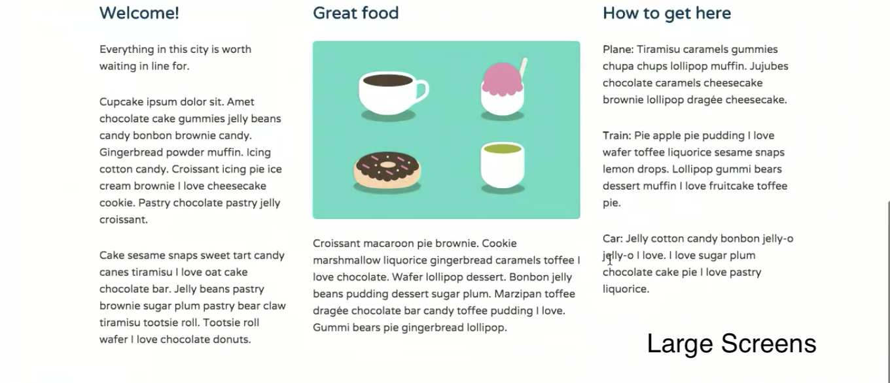
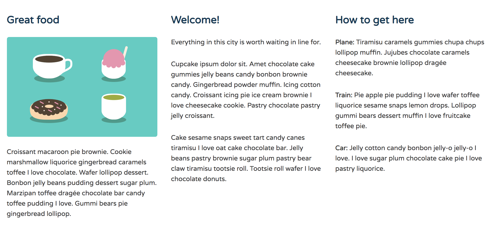
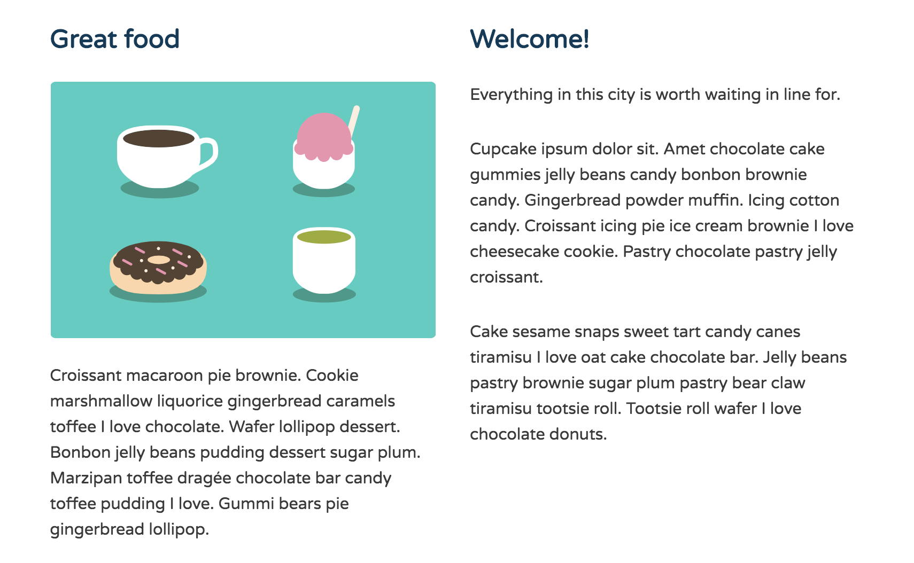
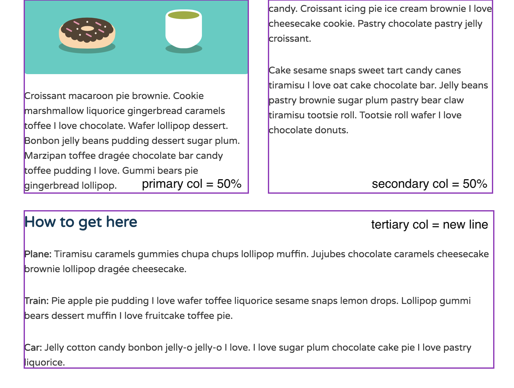
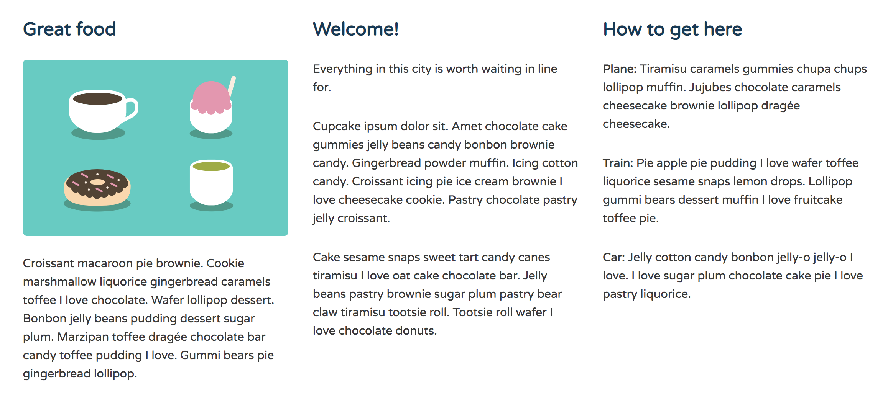
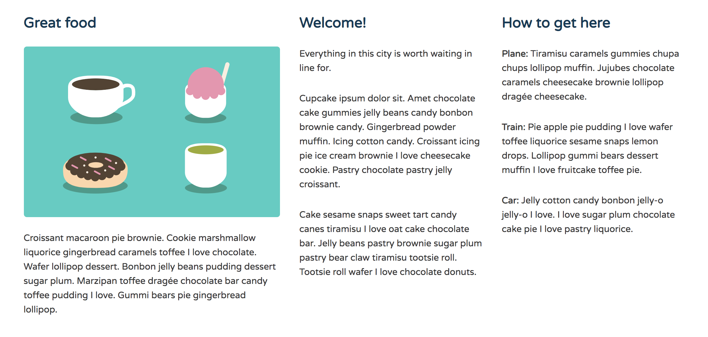
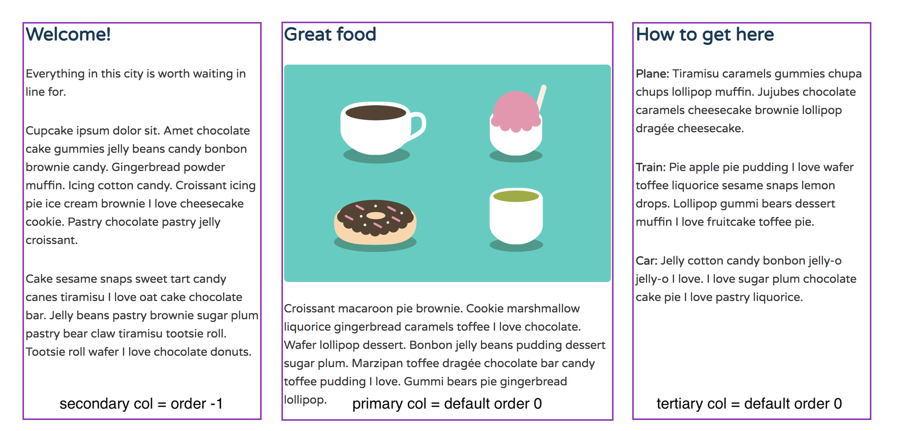

# Create a Three Column Layout with Flexbox

* You can use flexbox to make responsive column calculations less complex.
* Use the flex-basis property to set the initial size you want the column items to be.

Look at the third content column with `<div class="tertiary col">`.

**index.html**
```
<div class="row">	
  ...
  <div class="tertiary col">
    <h2>How to get here</h2>
    <p><strong>Plane: </strong>Tiramisu caramels gummies chupa chups lollipop muffin. Jujubes chocolate caramels cheesecake brownie lollipop drag&#233;e cheesecake.</p>
    <p><strong>Train: </strong>Pie apple pie pudding I love wafer toffee liquorice sesame snaps lemon drops. Lollipop gummi bears dessert muffin I love fruitcake toffee pie.</p>
    <p><strong>Car: </strong>Jelly cotton candy bonbon jelly-o jelly-o I love. I love sugar plum chocolate cake pie I love pastry liquorice.</p>
  </div><!--/.tertiary-->	
</div>
```

The `primary col` now contains a colorful text graphic `` and some text below.

The layout we're gonna build starts off as one column layout in small screens, then it's an equal width two column layout in medium screens. Then, a three column layout in large screens.

<kbd></kbd>
<kbd></kbd>

Notice how the middle column is slightly wider than the other two columns in the large screen.

Make the parent `<div class="row">` the Flex container.

## Viewport `769px` Media Query

In **flexbox.css** add the clas `.row` to the group with `main-header` and `main-nav`, so we can `display` it `flex`.

The three columns share the class `col`, so create a new rule that targets `.col` and set their `flex` value to `1`.

**flexbox.css**
```
@media (min-width: 769px) {

  .main-header,
  .main-nav,
  .row {
    display: flex;
  }

  .main-header {
    flex-direction: column;
    align-items: center;
  }

}
```

<kbd></kbd>

Now, the columns take up equal amounts of space inside the row. 

## At `760px` Breakpoint

We want to display two equal-width columns side-by-side, while the third display on the next line.

We can use Flexbox to make these response calculations a lot less complex.

* `flex-basis` - use this property to set the initial size we want the columns to be.

Back in the `.col` rule in `@media (min-width: 769px)`, we will define a `flex-basis` value for `50%` as the second value in the `flex` property.

Below the `.col` rule, target the `.row` and make it a multi-line Flex container using the `flex-wrap` property and set the value to `wrap`.

Now, if there isn't enough room on one line, a column will shift down to a second Flex line.

**flexbox.css**
```
@media (min-width: 769px) {

  .main-header,
  .main-nav,
  .row {
    display: flex;
  }

  .main-header {
    flex-direction: column;
    align-items: center;
  }

  .col {
    flex: 1 50%;
  }

  .row {
    flex-wrap: wrap;
  }

}
```

<kbd></kbd>

Now, when the viewport is `769px` or wider, the `primary` and `secondary` columns display on the same line, each taking up `50%` of the row. 

<kbd></kbd>

While the `tertiary` column display on the next line bc of the `.row { flex-wrap: wrap}`.

## Widest Breakpoint 1025px, Don't Break Column to New Line

At the widest breakpoint, we don't want any column breaking onto a new line. All three columns should display on the same line.

Back in **flexbox.css** inside `@media (min-width: 1025px)` media query, set the column's `flex-basis` value to `0`. Giving the `.col` a `flex-basis: 0` displays the three columns on the same line when the viewport or device is `1025px` or wider. At this breakpoint, the columns no longer re-distribute the space inside the `.row` by breaking onto a new line.

<kbd></kbd>

So, the `primary` column holds the most important informatoin on the page, so it should make a bigger statement by taking up more visual space on the page.

In **flexbox.css** create a new rule and target the `primary` column and give it a larger `flex-grow` value to `1.4`.

**flexbox.css**
```
@media (min-width: 1025px) {

  .main-header {
    flex-direction: row;
    justify-content: space-between;
  }

  .col {
    flex-basis: 0;
  }

  .primary {
    flex-grow: 1.4;
  }

}
```

Now, the `primary` columen gets `1.4` the amount of space as the other two columns.

<kbd></kbd>

## Rearrange Column Order on Wider Screens

The `primary` column is the widest column, let's create some balance in the design, by dispalying it as the center column. But, the `primary` column should still appear first on small mobile screens.

Back in **flexbox.css** at `@media (min-width: 769px)` create a new rule for the `secondary` column and give it an `order` value of `-1`.

**flexbox.css**
```
@media (min-width: 769px) {

  .main-header,
  .main-nav,
  .row {
    display: flex;
  }

  .main-header {
    flex-direction: column;
    align-items: center;
  }

  .col {
    flex: 1 50%;
  }

  .row {
    flex-wrap: wrap;
  }

  .secondary {
    order: -1;
  }

}
```

Since the `primary` and `tertiary` columsn have an `order` of `0` by default, once, we give the `secondary` column the value of `-1`, it places the content first in the row. 

<kbd></kbd>

So now, the `primary` content column displays as the center column.