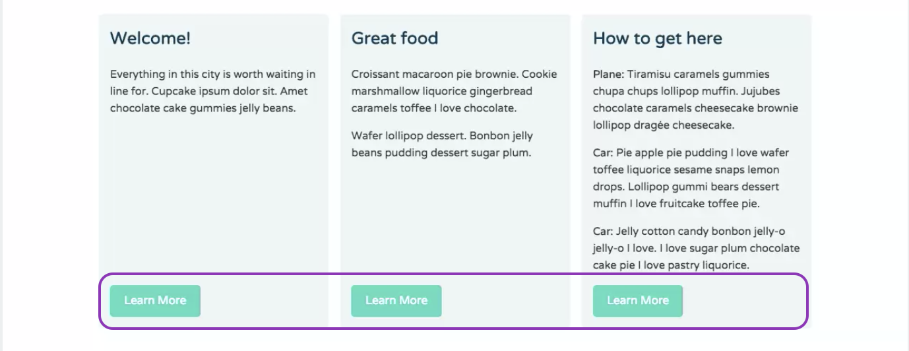
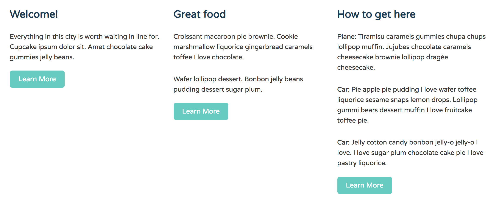
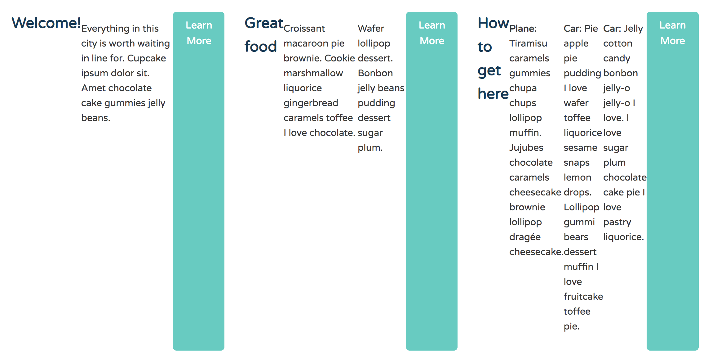
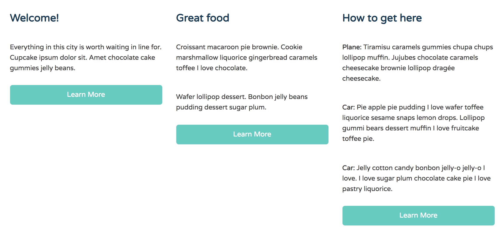
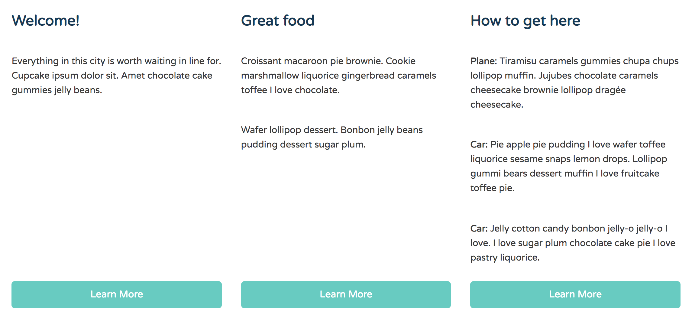
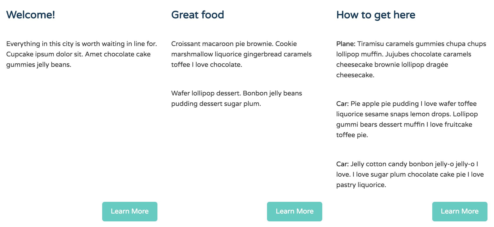

# Aligning Items to the Bottom of a Column

A common problem web designers/developers face when building layouts is figuring out how to align elements with the bottom edge of a container, regardless of the amount of content inside the container.

* It's possible for an element to be both a flex item and a flex container.
* A `margin` value of `auto` has an effect on flex item alignment because it absorbs any extra space around a flex item and pushes other flex items into different positions.

<kbd></kbd>

Using `floats` or other layout methods, it's really tricky to align content to the `bottom` of a container, but not with **Flexbox**.

Now in **index.html**, you'll see three equal `height` columns containing a heading, some paragraphs and a button below the paragraphs.

**index.html**
```
<!DOCTYPE html>
<html>
	<head>
		<meta name="viewport" content="width=device-width, initial-scale=1.0">
		<title>Best City Guide</title>
		<link href='https://fonts.googleapis.com/css?family=Varela+Round' rel='stylesheet' type='text/css'>
		<link rel="stylesheet" href="css/base.css">
		<link rel="stylesheet" href="css/flexbox.css">
	</head>
	<body>
		
		<header class="main-header">
			<h1 class="name"><a href="#">Best City Guide</a></h1>
			<ul class="main-nav">
				<li><a href="#">ice cream</a></li>
				<li><a href="#">donuts</a></li>
				<li><a href="#">tea</a></li>
				<li><a href="#">coffee</a></li>
			</ul>
		</header>

		<div class="banner">
			
			<h1 class="headline">The Best City</h1>
			<span class="tagline">The best drinks and eats in the best city ever.</span>
		</div>
		
		<div class="row">		
			<div class="primary col">
				<h2>Welcome!</h2>
				<p>Everything in this city is worth waiting in line for. Cupcake ipsum dolor sit. Amet chocolate cake gummies jelly beans.</p>
				<a class="button" href="#">Learn More</a>
			</div>
			
			<div class="secondary col">
				<h2>Great food</h2>
				<p>Croissant macaroon pie brownie. Cookie marshmallow liquorice gingerbread caramels toffee I love chocolate.</p>
				<p>Wafer lollipop dessert. Bonbon jelly beans pudding dessert sugar plum.</p>
				<a class="button" href="#">Learn More</a>
			</div>
				
			<div class="tertiary col">
				<h2>How to get here</h2>
				<p><strong>Plane: </strong>Tiramisu caramels gummies chupa chups lollipop muffin. Jujubes chocolate caramels cheesecake brownie lollipop drag&#233;e cheesecake.</p>
				<p><strong>Car: </strong>Pie apple pie pudding I love wafer toffee liquorice sesame snaps lemon drops. Lollipop gummi bears dessert muffin I love fruitcake toffee pie.</p>
				<p><strong>Car: </strong>Jelly cotton candy bonbon jelly-o jelly-o I love. I love sugar plum chocolate cake pie I love pastry liquorice.</p>
				<a class="button" href="#">Learn More</a>
			</div>
		</div>
		
		<footer class="main-footer">
			<span>&copy;2015 Residents of The Best City Ever.</span>
		</footer>
		
	</body>
</html>
```

<kbd></kbd>

The column on the right contains the most amount of content. These columns are Flex items, so the first and second columng stretch to match the height of the third column. But, the problem is that each column also has a buttons that appears below the content in each column.

To create more visual design consistency, all three buttons should align along the bottom edge of the columns. Even when the text in each column is different.

Flexbox makes aligning these buttons to the bottom super simple!

In **flexbox.css**, the parent `.row` is already a Flex container with its `display` property's value set to `flex`, which makes all three columns equal in height by default.

Earlier, we learned that it's possible for an element to be both a Flex item and Flex container. So now, we want to make the columns Flex containers so that we can have full control over the direction and alignment of the content inside them.

To make the columns a Flex container, simply group the class called `.col` along with the other Flex container classes in the media query (`.main-header`, `main-nav` and `.row`). 

**flexbox.css**
```
@media (min-width: 769px) {

  .main-header,
  .main-nav,
  .row,
  .col {
    display: flex;
  }

  .main-header {
    flex-direction: column;
    align-items: center;
  }

  .col {
    flex: 1;
  }

}
```

Now, each column is now a Flex container. This means that the `<h1>`, `<p>` and `<button>` inside them are all Flex items.

Remember that Flex containers display their children Flex items horizontally by default.

<kbd></kbd>

So now, the `<h1>`, `<p>` and `<button>` are laid out on the same line. We can easily be adjusted. To fix this, go to `.col` rule inside the `769px` media query and set the `flex-driection` to `column`.

**flexbox.css**
```
@media (min-width: 769px) {

  .main-header,
  .main-nav,
  .row,
  .col {
    display: flex;
  }

  .main-header {
    flex-direction: column;
    align-items: center;
  }

  .col {
    flex: 1;
    flex-direction: column;
  }

}
```

<kbd></kbd>

Now, the Flex items are vertically stiacked inside their columns. But, this doesn't solve the button alignment problem. By now, you know that a `margin` value of `auto` has a effect on Flex item alignement bc it absorbs any extra space around a Flex item and pushes other Flex items into different positions.

In **flexbox.css**, create a new rule that targets `.button` Flex items and give them a `margin-top` property with a value of `auto`.

<kbd></kbd>

Cool, it pins the `button` to the bottom of the columns. The browser automatically inserts the extra space in a column between the `button` and the Flex item above it.

If you don't want the buttons to stretch the full width of a column, you can change their alignment on the Cross axis using the `align-self` property with the value of `flex-start` or `flex-end`.

**flexbox.css**
```
@media (min-width: 769px) {

  .main-header,
  .main-nav,
  .row,
  .col {
    display: flex;
  }

  .main-header {
    flex-direction: column;
    align-items: center;
  }

  .col {
    flex: 1;
    flex-direction: column;
  }

  .button {
    margin-top: auto;
    align-self: flex-end;
  }

}
```

<kbd></kbd>


<kbd></kbd>