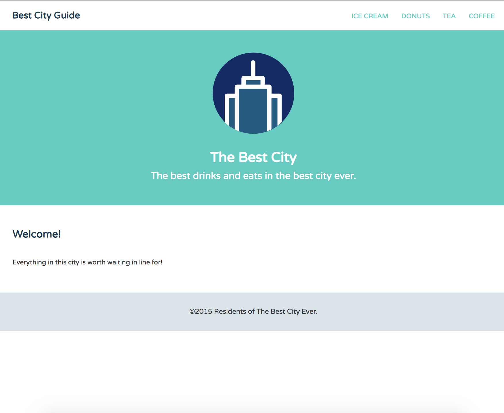
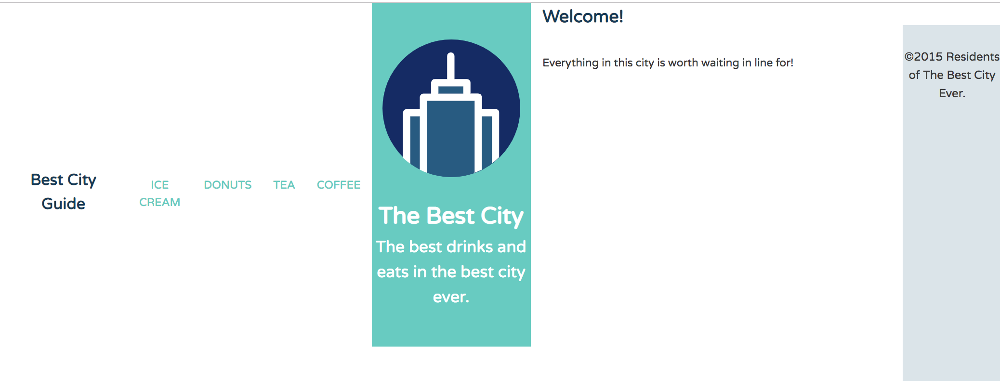
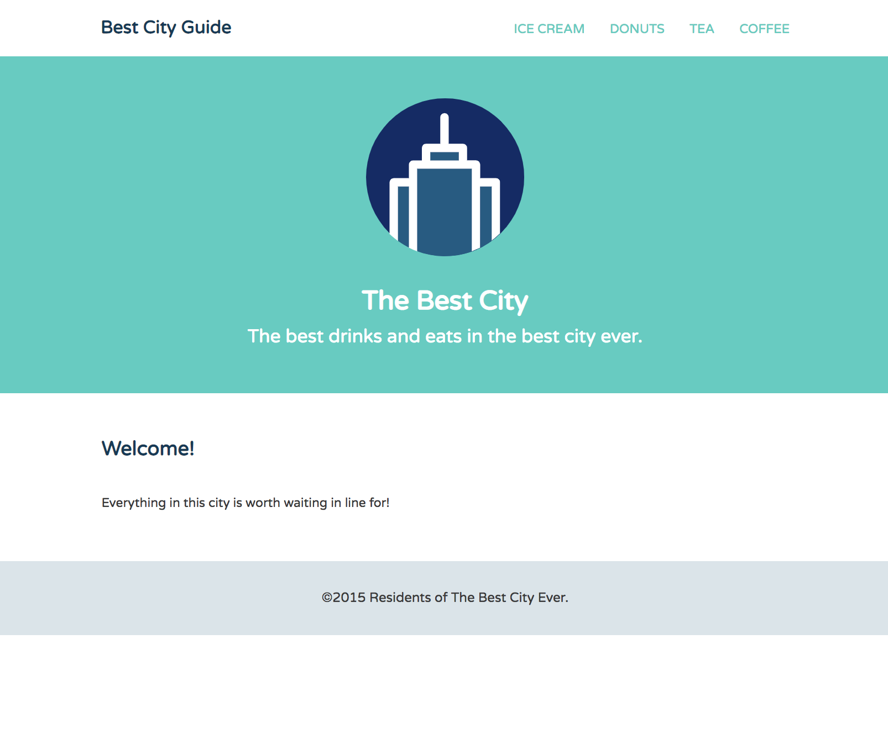

# Creating a Stickey Footer with Flexbox

A sticky footer is a footer that sticks to the bottom of the page, regardless of the amount of content on the page. 

If a page’s content is shorter than the height of the browser, you end up with a footer that sits near the middle of the page, instead of at the bottom, where it belongs. Bc of that, you get that ugly gap between the bottom of the viewport and the footer.

**index.html**
```
<!DOCTYPE html>
<html>
	<head>
		<meta name="viewport" content="width=device-width, initial-scale=1.0">
		<title>Best City Guide</title>
		<link href='https://fonts.googleapis.com/css?family=Varela+Round' rel='stylesheet' type='text/css'>
		<link rel="stylesheet" href="css/base.css">
		<link rel="stylesheet" href="css/flexbox.css">
	</head>
	<body>
		
		<header class="main-header">
			<h1 class="name"><a href="#">Best City Guide</a></h1>
			<ul class="main-nav">
				<li><a href="#">ice cream</a></li>
				<li><a href="#">donuts</a></li>
				<li><a href="#">tea</a></li>
				<li><a href="#">coffee</a></li>
			</ul>
		</header><!--/.main-header-->   

		<div class="banner">
			
			<h1 class="headline">The Best City</h1>
			<span class="tagline">The best drinks and eats in the best city ever.</span>
		</div><!--/.banner-->
		
		<div class="row">		
			<div class="primary col">
				<h2>Welcome!</h2>
				<p>Everything in this city is worth waiting in line for!</p>
			</div><!--/.primary-->
		</div>
		
		<footer class="main-footer">
			<div class="footer-inner">
				<span>&copy;2015 Residents of The Best City Ever.</span>
			</div>
		</footer>
		
	</body>
</html>
```

<kbd></kbd>

This is a common problem in web design. There are different methods of creating sticky footers with CSS. one popular method is **CSS calc function** and the **viewport relative (VH unit)**, but Flexbox's flexibility is also a great solution for these types of problems. Other sticky footer methods involve do calculations that subtract the footer's height from the total height of the browser. Or, other methods involve adding an extra wrapper `<div>` to your site just to force the footer down to the bottom of the page.

Flexbox is a great solution for fixing these types of problems. You can make the footer stick to bottom without adding extra elements or doing any calculations.

We're gonna follow the mobile first approach, we'll write these Flexbox porperties as base styles outside of any media query, so they apply to all screen sizes and devices.

The first thing to do, is make the `body` of the page a Flex container. Then, set its `flex-direction` to `column`.

<kbd></kbd>

**flex.css**
```
body {
  display: flex;
  flex-direction: column;
}
```

Setting the `body` element to `flex`, makes the child containers of the `body` Flex items. So now, `main-header`, `banner`, `row` and `main-footer` are all Flex items.

And, setting `flex-direction` to `column`, stacks the elements vertically, otherwise, they're gonna be laid out horizontally on a single line.

<kbd></kbd>

Next, give the `body` a `min-height` of `100vh`. This means that the `body`'s `height` will take up at least the entire height of the viewport.

* `1vh` is equal to 1/100 or 1% of the `height` of the viewport.

**flex.css**
```
body {
  display: flex;
  flex-direction: column;
  min-height: 100vh;
}
```

Back in the browser, nothing too special happens yet by just adding `min-height: 100vh;` to the `body`. The element types are still based on the content inside them, so we still get the gap at the bottom of the page.

Now, we want the `.row` container to stretch, so that it fills all the free vertical space inside the `body`.

We know that the `flex-grow` and `flex` properties determines how much of the available space should take inside the Flex container an item should take up.

So, go back to base styles and target the `.row` container and set its `flex` property to the value of `1`. Or, you can also use the `flex-grow` property and it'll work the same way.

**flex.css**
```
body {
  display: flex;
  flex-direction: column;
  min-height: 100vh;
}

.row {
  flex: 1;
}
```

Now, the `.row` stretches to fill all the available space. It pushes the footer down to the bottom of the viewport. That's pretty much it.

<kbd></kbd>

The other sticky footer methods works well only when the footer has a fixed height.

What's great about the Flexbox method is that you can have a flexible multi-lined footer in your layout.

