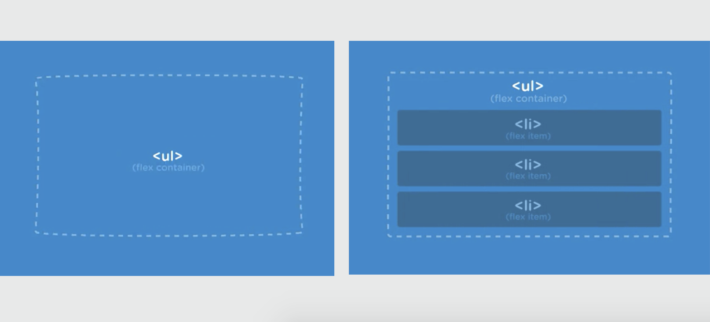
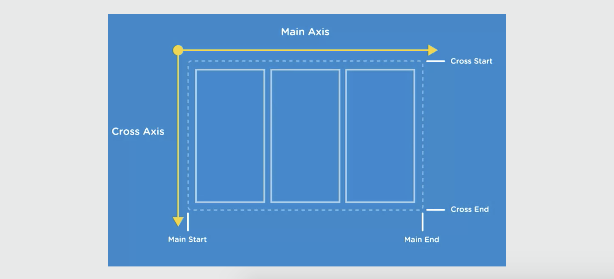
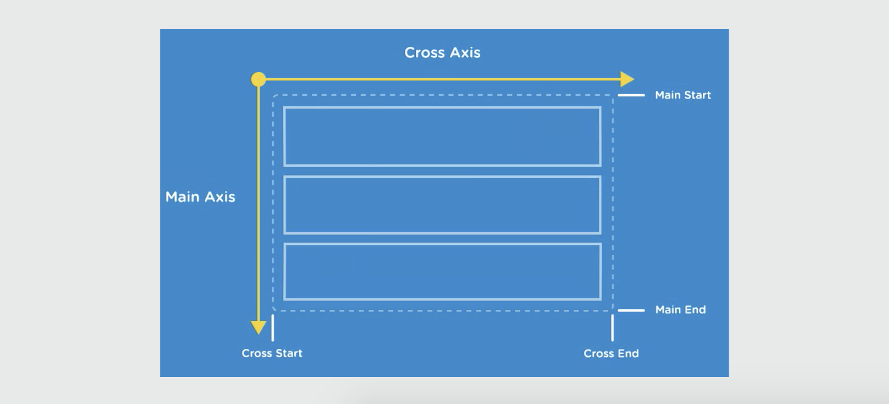

# Flexbox Notes

Important Flexbox Elements

## Flexbox Container and Items

* **Flex containers** - sets the context for the layout and contains flex items, the actual element you layout using flexbox. It can be any block level or inline element (like a ```<div>```, ```<ul>```, etc.)
* **Flex items** - every direct child of a flex container is called a flex item. There can be any number of flex items inside a flex container.

Say the ```<ul>``` is a Flex container and the ```<li>``` elements are the Flex items. Once the children are Flex items, you can take advantage of Flexbox's powerful alignment properties.

Flex Container & Flex Items

<kbd></kbd>

With Flexbox's alignment properties, the ```<li>``` can be laid out in any direction and can have flexible dimensions that adapt to the available space inside the ```<ul>```.

## Flexbox Axes

Everything in a Flexbox is **relative** to these two axes.

* **Main axis** - is the primary axis (top horizontal) along which Flex items are laid out. It defines the direction of the Flex items in the Flex container.

* **Cross axis** - runs perpendicular to the Main axis

<kbd></kbd>

Each axis has a start side and an end side.

* The default **main start** and the **main end** direction of the main axis is left to right.
* The default direction of the cross axis is top to bottom.

<kbd></kbd>

But, you can easily change the directions. For example, you can switch **column layout** along the main axis to a vertical layout using Flexbox properties.

<kbd></kbd>